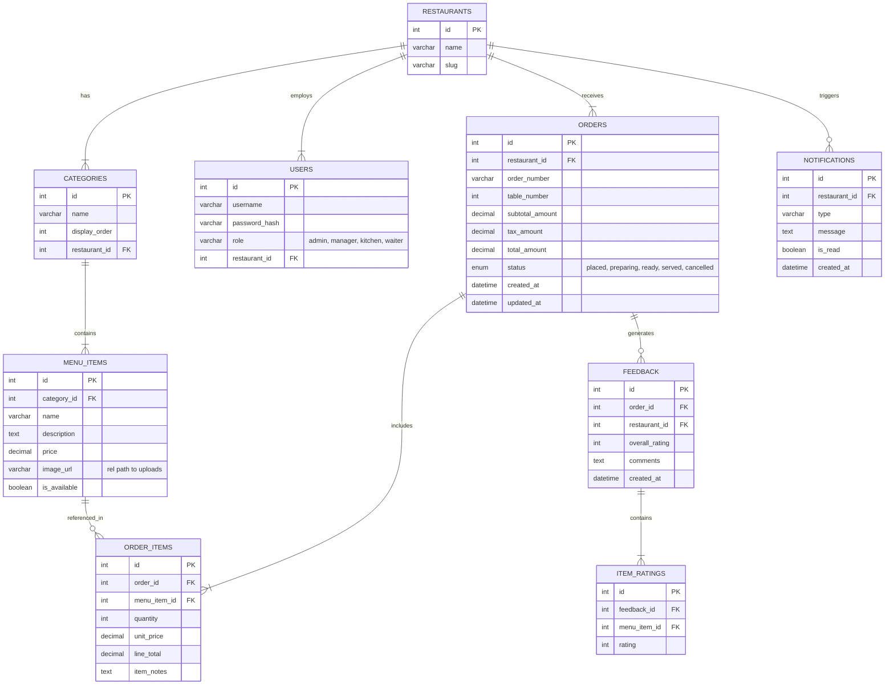

## COMPLETE_PROJECT_REPORT.md  
### Master Project Report – Obito Ani Foodzz  

---

### Preliminary Pages

#### Title

**Project Title**: Obito Ani Foodzz – Intelligent Restaurant Management and Ordering System  
**Domain**: Web-based Enterprise Application (Restaurant Operations, Point-of-Sale, and Kitchen Management)  
**Tech Stack**: PHP 8, MySQL, JavaScript (Vanilla + ES6), CSS3 (Custom Grid/Flex), Pexels API  

#### Abstract

The rapid digitalization of the food and hospitality industry has transformed how customers discover, order, and experience restaurant services. Traditional paper-based menus, handwritten orders, and unstructured communication between waiters and the kitchen frequently result in delays, errors, and poor customer satisfaction. **Obito Ani Foodzz** is a full-stack, web-based restaurant management system that integrates customer ordering, administrative control, and kitchen workflow into a unified platform.  

The system provides an interactive customer-facing interface for browsing menu items, placing table-based orders, and submitting feedback. A role-based administration panel allows authorized personnel to manage categories, menu items, pricing, offers, and restaurant analytics. A specialized Kitchen Display System (KDS) enables chefs and kitchen staff to monitor incoming orders, update preparation statuses, and signal readiness in real time. The platform leverages a robust MySQL database, an automated asset pipeline using the Pexels API for high-quality food imagery, and a carefully designed workflow to ensure data consistency, operational efficiency, and scalability.  

In addition to core ordering and menu management functionalities, Obito Ani Foodzz integrates features such as verified customer reviews, granular dish ratings, and automated notification mechanisms. The proposed solution addresses key operational challenges, including inaccurate order capture, slow table turnaround times, and lack of centralized visibility into restaurant performance. This report presents the detailed motivation, feasibility analysis, system design, database schema, implementation strategy, testing suite, and future roadmap of the system, aligning with academic and industry standards for final-year engineering projects.  

#### Keywords

Restaurant Management System; Web Application; Kitchen Display System; Online Ordering; MySQL Database; PHP; DFD; ER Diagram; User Flow; Automation; Pexels API.  

---

### Chapter 1: Detailed Motivation, Problem Statement, and Formal System Background

#### 1.1 Introduction

The restaurant industry operates in a high-pressure environment where customer satisfaction depends on the speed, accuracy, and consistency of service. Conventional practices—such as handwritten order slips, verbal communication between waiters and kitchen staff, and static printed menus—are vulnerable to human error, miscommunication, and inefficiencies. As customer expectations evolve toward real-time visibility, personalized experiences, and digital convenience, restaurants increasingly require integrated information systems that streamline operations and provide actionable insights.  

**Obito Ani Foodzz** is conceived as a comprehensive restaurant management and ordering system that bridges the gap between customers, administrative staff, and kitchen teams. The system aims to replace fragmented tools and manual workflows with a cohesive, database-driven solution that supports menu browsing, order placement, kitchen tracking, and feedback management within a single monolithic application.  

#### 1.2 Motivation

- **Operational Inefficiency**: Restaurants frequently suffer from bottlenecks when orders are misrouted, delayed, or misplaced. Manual tracking of orders across tables and kitchen sections introduces latency and error.  
- **Lack of Real-Time Visibility**: Managers often lack immediate insight into current orders, table statuses, and revenue metrics, making it difficult to optimize staffing and inventory.  
- **Customer Experience Gaps**: Customers expect visually rich, accurate menus and transparent order statuses. Static menus and opaque order handling undermine trust and satisfaction.  
- **Data Fragmentation**: Feedback, ratings, and reviews are often captured informally (verbally or via third-party platforms), leading to limited actionable feedback for improving dishes and service quality.  
- **Scalability Concerns**: As a restaurant grows or adopts multi-branch operations, ad-hoc or spreadsheet-based solutions fail to scale effectively.  

The motivation behind this project is to design and implement an integrated platform where all stakeholders—customers, administrators, managers, chefs, and waiters—interact with a single, consistent information system.  

#### 1.3 Problem Statement

Design and implement a **web-based, database-driven restaurant management system** that:  

- Provides customers with an intuitive interface to browse the menu, visualize dishes, customize items, and place orders by table.  
- Enables administrators to manage menu categories, items, availability, prices, and track order histories and feedback.  
- Supplies kitchen staff with a live, auto-refreshing dashboard of active orders, allowing for efficient preparation and status updates (placed, preparing, ready, served).  
- Ensures reliable data storage using a normalized MySQL database, including strong referential integrity between restaurants, users, orders, items, and feedback.  
- Incorporates an automated image management pipeline leveraging the Pexels API to populate high-quality, license-compliant food images without manual intervention.  
- Supports future extensibility toward analytics, mobile integration, and advanced decision support.  

#### 1.4 Objectives

- **Primary Objective**:  
  To develop a robust, full-stack restaurant management system that unifies customer ordering, administrative control, and kitchen operations.  

- **Secondary Objectives**:  
  - To design a normalized database schema that supports multi-tenant (multi-restaurant) operations.  
  - To implement role-based access for various users such as administrators, managers, and kitchen staff.  
  - To ensure persistence of cart data on the customer side using LocalStorage for better UX.  
  - To embed an automated data setup script that can initialize and reset the database along with image assets.  
  - To implement feedback and rating mechanisms for continuous service quality improvement.  

#### 1.5 Scope of the System

- **In-Scope**:  
  - Table-based ordering from within the restaurant premises.  
  - Customer-facing menu browsing with images, descriptions, and pricing.  
  - Admin modules for managing menu items, categories, and viewing order histories and feedback.  
  - Kitchen dashboard for monitoring orders and updating statuses.  
  - Automated image fetching and database population.  

- **Out-of-Scope (Current Version)**:  
  - Online payments and external delivery integrations.  
  - Inventory management with supplier integration.  
  - AI-driven demand forecasting (planned for future work).  

#### 1.6 Formal System Background

The system adheres to the principles of **three-tier architecture**:  

- **Presentation Layer**: Implemented using PHP views and HTML/CSS/JavaScript for user interfaces across customer, admin, and kitchen modules.  
- **Application/Business Logic Layer**: Encapsulated in PHP controllers and backend scripts that handle requests, apply business rules, invoke database operations, and format responses.  
- **Data Layer**: Composed of a relational MySQL database with multiple interconnected tables such as `restaurants`, `users`, `categories`, `menu_items`, `orders`, `order_items`, `feedback`, `item_ratings`, and `notifications`.  

The system further incorporates principles of **Role-Based Access Control (RBAC)**, **data normalization**, and **transactional integrity** to provide a formal foundation suitable for academic scrutiny and real-world usage.  

---

### Chapter 2: In-Depth Feasibility Study and Comprehensive Requirement Analysis

#### 2.1 Technical Feasibility

- **Technology Stack Suitability**:  
  PHP 8 is a mature, widely adopted server-side language that integrates efficiently with Apache and MySQL in the XAMPP environment. MySQL provides ACID-compliant transactional behavior and rich SQL querying capabilities. JavaScript (Vanilla + ES6) enables dynamic interaction on the client side, while CSS3 with Flex and Grid supports responsive UI design.  

- **Development Environment**:  
  The project can be developed and hosted on a standard XAMPP stack, requiring modest hardware resources. The use of LocalStorage for cart persistence ensures minimal server load for state tracking across page refreshes.  

- **Third-Party Integration**:  
  The integration with the Pexels API for image retrieval is technically feasible via HTTP requests from backend PHP scripts. The system stores only relative paths to the downloaded images, ensuring loose coupling between external APIs and internal storage.  

#### 2.2 Operational Feasibility

- **Ease of Use for Staff**:  
  The admin and kitchen interfaces employ intuitive navigation, prominent action buttons, and minimal text input for most operations (e.g., single-click status updates for orders). This minimizes the training effort required for non-technical staff.  

- **Adaptation to Existing Processes**:  
  The workflow mirrors traditional restaurant operations—orders are tied to tables, kitchen staff mark status transitions, and administrators review sales and feedback. Thus, the system complements existing processes rather than forcing drastic procedural changes.  

- **Maintainability**:  
  The monolithic structure keeps deployment and maintenance simple for small to medium-scale restaurants. Clear module boundaries (Frontend, Admin Panel, Kitchen Panel) support straightforward troubleshooting and enhancements.  

#### 2.3 Economic Feasibility

- **Initial Investment**:  
  - Hardware: A single server (or a capable workstation) for hosting the application and database.  
  - Software: All primary technologies (PHP, MySQL, Apache, XAMPP) are open-source and free.  
  - Development: Time cost for implementation, testing, and documentation.  

- **Operational Costs**:  
  - Electricity and basic networking infrastructure.  
  - Occasional maintenance/backup and minimal external API usage (Pexels is typically free within limits).  

- **Return on Investment (ROI)**:  
  - Faster table turnover due to streamlined ordering.  
  - Reduced human errors, leading to fewer order returns or complaints.  
  - Better insights into popular dishes and customer feedback, enabling data-driven menu optimization.  

Overall, the economic analysis indicates that the system is highly feasible for small and medium-sized restaurants, with low ongoing costs and significant potential gains in efficiency and customer satisfaction.  

#### 2.4 Comprehensive Functional Requirements

- **Customer Module Requirements**:  
  - FR-C1: The system shall allow customers to view menu categories and items with images, descriptions, and prices.  
  - FR-C2: The system shall support adding/removing items to a cart with quantity and special instructions.  
  - FR-C3: The system shall persist cart data in LocalStorage to survive page refreshes.  
  - FR-C4: The system shall allow customers to place orders mapped to a specific table number.  
  - FR-C5: The system shall display an order confirmation summary with total amount, applicable taxes, and unique order number.  

- **Admin Module Requirements**:  
  - FR-A1: The system shall authenticate administrators with a username and password.  
  - FR-A2: The system shall provide forms to create, update, and delete categories and menu items.  
  - FR-A3: The system shall allow toggling item availability (e.g., in-stock/out-of-stock).  
  - FR-A4: The system shall display dashboards with summary statistics such as active orders, total revenue, and item availability.  
  - FR-A5: The system shall provide views for historical orders and allow basic filtering by date or status.  
  - FR-A6: The system shall capture and display customer feedback and allow administrative replies.  

- **Kitchen Module Requirements**:  
  - FR-K1: The system shall authenticate kitchen users with appropriate credentials.  
  - FR-K2: The system shall periodically refresh the order list (e.g., every 30 seconds) or use WebSocket-based updates if configured.  
  - FR-K3: The system shall allow kitchen staff to change order statuses from `placed` to `preparing` and `ready`.  
  - FR-K4: The system shall highlight orders based on their age or priority using color coding.  

- **Cross-Cutting Requirements**:  
  - FR-X1: The system shall maintain referential integrity across all relational tables.  
  - FR-X2: The system shall log relevant actions via notifications (e.g., new order, item out of stock).  
  - FR-X3: The system shall provide controlled access based on user roles (admin, manager, kitchen, etc.).  

#### 2.5 Non-Functional Requirements

- **Performance**:  
  Pages should load within acceptable time (< 3 seconds under normal network conditions). Order placement and status updates should be near real-time.  

- **Security**:  
  Basic authentication is enforced for admin and kitchen modules. Database access is controlled via secure credentials. Pexels API key is stored in backend configuration (with a recommendation to move to environment variables in production).  

- **Usability**:  
  Interfaces are designed using consistent monochrome and highlight colors, large tap targets for kitchen interactions, and modal dialogs for detailed item views.  

- **Reliability and Availability**:  
  The system is expected to be available during restaurant operating hours with regular backups of the database and uploads directory.  

- **Scalability**:  
  The underlying database design supports additional restaurants, users, and menu items without schema changes, making the system suitable for multi-branch expansion.  

---

### Chapter 3: Expanded Database Dictionary, Physical Design, and Logical Integrity

#### 3.1 Logical ER Diagram (Consolidated)

#### 3.2 Physical Database Design and Data Types

Below is an expanded database dictionary highlighting physical data types, constraints, and integrity rules.  

##### 3.2.1 Table: `restaurants`

| Field        | Type           | Constraints           | Description                          |
|-------------|----------------|-----------------------|--------------------------------------|
| id          | INT            | PK, AUTO_INCREMENT    | Unique identifier for restaurant     |
| name        | VARCHAR(150)   | NOT NULL              | Legal/brand name of the restaurant   |
| slug        | VARCHAR(100)   | UNIQUE, NOT NULL      | URL-friendly identifier              |

##### 3.2.2 Table: `users`

| Field          | Type           | Constraints                         | Description                                  |
|---------------|----------------|-------------------------------------|----------------------------------------------|
| id            | INT            | PK, AUTO_INCREMENT                  | Unique user identifier                       |
| username      | VARCHAR(100)   | UNIQUE, NOT NULL                    | Login username                               |
| password_hash | VARCHAR(255)   | NOT NULL                            | Secure hash of password                      |
| role          | ENUM           | CHECK (role in allowed set)         | User role: admin, manager, kitchen, waiter   |
| restaurant_id | INT            | FK → restaurants(id), NOT NULL      | Associated restaurant                        |

##### 3.2.3 Table: `categories`

| Field          | Type           | Constraints                               | Description                          |
|---------------|----------------|-------------------------------------------|--------------------------------------|
| id            | INT            | PK, AUTO_INCREMENT                        | Category identifier                  |
| name          | VARCHAR(100)   | NOT NULL                                  | Category name (Breakfast, Lunch)     |
| display_order | INT            | DEFAULT 0                                 | Ordering for UI display              |
| restaurant_id | INT            | FK → restaurants(id), NOT NULL            | Owner restaurant                     |

##### 3.2.4 Table: `menu_items`

| Field       | Type           | Constraints                               | Description                                  |
|------------|----------------|-------------------------------------------|----------------------------------------------|
| id         | INT            | PK, AUTO_INCREMENT                        | Menu item identifier                         |
| category_id| INT            | FK → categories(id), NOT NULL             | Category to which the item belongs           |
| name       | VARCHAR(150)   | NOT NULL                                  | Dish name                                    |
| description| TEXT           | NULL                                      | Item description and ingredients             |
| price      | DECIMAL(10,2)  | NOT NULL, CHECK (price >= 0)              | Unit price                                   |
| image_url  | VARCHAR(255)   | NULL                                      | Relative path to uploaded image              |
| is_available | TINYINT(1)   | DEFAULT 1                                 | Availability flag                            |

##### 3.2.5 Table: `orders`

| Field          | Type           | Constraints                                      | Description                                  |
|---------------|----------------|--------------------------------------------------|----------------------------------------------|
| id            | INT            | PK, AUTO_INCREMENT                               | Order identifier                             |
| restaurant_id | INT            | FK → restaurants(id), NOT NULL                   | Restaurant where order is placed             |
| order_number  | VARCHAR(50)    | UNIQUE, NOT NULL                                 | Human-readable order reference               |
| table_number  | INT            | NOT NULL                                         | Table identifier                             |
| subtotal_amount | DECIMAL(10,2)| NOT NULL, CHECK (subtotal_amount >= 0)           | Sum of line totals before tax                |
| tax_amount    | DECIMAL(10,2)  | NOT NULL, CHECK (tax_amount >= 0)                | Total tax (e.g., CGST+SGST)                  |
| total_amount  | DECIMAL(10,2)  | NOT NULL, CHECK (total_amount = subtotal_amount + tax_amount) | Final billable amount              |
| status        | ENUM           | allowed: 'placed','preparing','ready','served','cancelled' | Order lifecycle state        |
| created_at    | DATETIME       | DEFAULT CURRENT_TIMESTAMP                        | Time when order is created                   |
| updated_at    | DATETIME       | ON UPDATE CURRENT_TIMESTAMP                      | Last update timestamp                         |

##### 3.2.6 Table: `order_items`

| Field       | Type           | Constraints                               | Description                                  |
|------------|----------------|-------------------------------------------|----------------------------------------------|
| id         | INT            | PK, AUTO_INCREMENT                        | Line item identifier                         |
| order_id   | INT            | FK → orders(id), NOT NULL                 | Reference to parent order                    |
| menu_item_id| INT           | FK → menu_items(id), NOT NULL             | Reference to ordered dish                    |
| quantity   | INT            | NOT NULL, CHECK (quantity > 0)            | Number of units ordered                      |
| unit_price | DECIMAL(10,2)  | NOT NULL, CHECK (unit_price >= 0)         | Captured price at order time                 |
| line_total | DECIMAL(10,2)  | NOT NULL, CHECK (line_total = quantity * unit_price) | Extended amount                    |
| item_notes | TEXT           | NULL                                      | Optional special instructions                |

##### 3.2.7 Table: `feedback`

| Field        | Type           | Constraints                               | Description                                  |
|-------------|----------------|-------------------------------------------|----------------------------------------------|
| id          | INT            | PK, AUTO_INCREMENT                        | Feedback record identifier                   |
| order_id    | INT            | FK → orders(id), NOT NULL                 | Related order                                |
| restaurant_id| INT           | FK → restaurants(id), NOT NULL            | Restaurant under feedback                    |
| overall_rating | TINYINT      | CHECK (overall_rating BETWEEN 1 AND 5)    | Overall rating for experience                |
| comments    | TEXT           | NULL                                      | Free-form feedback                           |
| created_at  | DATETIME       | DEFAULT CURRENT_TIMESTAMP                 | When feedback was submitted                  |

##### 3.2.8 Table: `item_ratings`

| Field        | Type           | Constraints                               | Description                                  |
|-------------|----------------|-------------------------------------------|----------------------------------------------|
| id          | INT            | PK, AUTO_INCREMENT                        | Item rating identifier                       |
| feedback_id | INT            | FK → feedback(id), NOT NULL               | Parent feedback                              |
| menu_item_id| INT            | FK → menu_items(id), NOT NULL             | Rated dish                                   |
| rating      | TINYINT        | CHECK (rating BETWEEN 1 AND 5)            | Star rating for the item                     |

##### 3.2.9 Table: `notifications`

| Field        | Type           | Constraints                               | Description                                  |
|-------------|----------------|-------------------------------------------|----------------------------------------------|
| id          | INT            | PK, AUTO_INCREMENT                        | Notification identifier                      |
| restaurant_id| INT           | FK → restaurants(id), NOT NULL            | Associated restaurant                        |
| type        | VARCHAR(50)    | NOT NULL                                  | Event type (e.g., 'NEW_ORDER','LOW_STOCK')  |
| message     | TEXT           | NOT NULL                                  | Descriptive message                          |
| is_read     | TINYINT(1)     | DEFAULT 0                                 | Read/unread flag                             |
| created_at  | DATETIME       | DEFAULT CURRENT_TIMESTAMP                 | Notification creation time                   |

#### 3.3 Data Integrity and Constraints

- **Entity Integrity**: All primary keys are non-null and auto-incremented where applicable.  
- **Referential Integrity**: Foreign key constraints ensure that orders cannot exist without a restaurant, order_items cannot exist without corresponding orders and menu_items, and feedback is linked to valid orders and restaurants.  
- **Domain Integrity**: ENUM and CHECK constraints enforce valid statuses, roles, and rating ranges.  
- **Business Rules**:  
  - Total amount must equal subtotal plus tax.  
  - Line total must equal quantity multiplied by unit price.  
  - Ratings must be within the range 1–5.  

---

### Chapter 3 (Continued): DFDs, Workflows, and User Flows

#### 3.4 Context-Level DFD (Level 0)

#### 3.5 DFD Level 1 – Ordering and Fulfilment

#### 3.6 Logical Data Flow for Feedback

#### 3.7 User Flow (Sequence Diagram – Core Ordering)

#### 3.8 Workflow Diagram – Kitchen Escalation Logic

---

### Chapter 4: Detailed Testing Suite and Implementation Notes

#### 4.1 Implementation Overview

The application is structured under a unified project root with distinct directories for frontend, backend, and assets. Core pages include `index.php`, `cart.php`, `order-confirmation.php`, along with administrative and kitchen dashboards under `frontend/admin/` and `frontend/kitchen/`. The backend scripts handle database connections, sanitization of inputs, and business rule enforcement for order creation, menu management, and feedback processing.  

The automation script `backend/setup_db.php` coordinates database schema creation using `complete-setup.sql`, manages initial data seeding, and integrates with the Pexels API to ensure all menu items are visually represented with unique images.  

#### 4.2 Testing Strategy

Testing is organized into **unit tests** for individual functions, **integration tests** for combined module behavior, and **system tests** for end-to-end user flows. Special attention is given to authentication, business logic (e.g., tax calculation, order status transitions), and database constraint validation.  

#### 4.3 Sample Test Cases – Authentication and Access Control

| TC ID  | Module        | Test Description                                      | Pre-Conditions                        | Steps                                                                 | Expected Result                                           |
|-------|---------------|-------------------------------------------------------|---------------------------------------|-----------------------------------------------------------------------|-----------------------------------------------------------|
| TC-A1 | Admin Login   | Valid admin credentials                               | Admin user exists                     | 1. Navigate to `admin/login.php` 2. Enter correct username/password  | User redirected to admin `dashboard.php`                  |
| TC-A2 | Admin Login   | Invalid credentials                                   | None                                  | 1. Navigate to `admin/login.php` 2. Enter wrong password             | Error message displayed, no session created               |
| TC-A3 | Kitchen Login | Kitchen user access                                   | Kitchen user exists                   | 1. Open `kitchen/login.php` 2. Enter valid credentials               | Redirected to kitchen `dashboard.php`                     |
| TC-A4 | Session Guard | Direct access without login                           | None                                  | 1. Open `admin/dashboard.php` without session                        | System redirects back to `login.php`                      |

#### 4.4 Sample Test Cases – Ordering and Cart Logic

| TC ID  | Module        | Test Description                                      | Steps                                                                                       | Expected Result                                           |
|-------|---------------|-------------------------------------------------------|---------------------------------------------------------------------------------------------|-----------------------------------------------------------|
| TC-O1 | Cart          | Add single item to cart                               | 1. Open `index.php` 2. Click "Add to Cart" on a menu item                                   | Cart icon/badge reflects quantity 1, item shown in cart   |
| TC-O2 | Cart          | Update item quantity                                  | 1. Add item to cart 2. Increase quantity to 3                                              | Cart total reflects updated quantity and price            |
| TC-O3 | Cart          | Persistence across refresh                            | 1. Add items 2. Refresh browser page                                                        | Cart state remains unchanged (LocalStorage intact)        |
| TC-O4 | Order         | Place valid order                                     | 1. Fill cart 2. Enter table number 3. Confirm order                                        | Order stored in DB, confirmation page displayed           |
| TC-O5 | Order         | Invalid table number                                  | 1. Fill cart 2. Enter non-numeric or out-of-range table number                             | Validation error, no order created                        |

#### 4.5 Sample Test Cases – Database Constraints and Integrity

| TC ID  | Area           | Test Description                                    | Method                                                          | Expected Result                                           |
|-------|----------------|-----------------------------------------------------|-----------------------------------------------------------------|-----------------------------------------------------------|
| TC-DB1| Referential FK  | Insert `order_items` with non-existing order_id    | Attempt to insert using SQL script                             | Database rejects insert with FK violation                 |
| TC-DB2| Rating Bounds   | Insert rating outside [1,5]                         | Attempt to insert rating=6 into `item_ratings`                 | Database rejects insert due to CHECK constraint           |
| TC-DB3| Cascade Delete  | Delete menu item with existing order_items          | Attempt to delete a `menu_items` row referenced by `order_items` | Delete disallowed or cascades according to design policy |
| TC-DB4| Status Enum     | Set order status to invalid value                   | Attempt manual SQL update with status='unknown'                | Update rejected                                           |

#### 4.6 Sample Test Cases – Feedback and Reviews

| TC ID  | Module   | Test Description                                         | Steps                                                                 | Expected Result                                                |
|-------|----------|----------------------------------------------------------|-----------------------------------------------------------------------|----------------------------------------------------------------|
| TC-F1 | Feedback | Submit feedback with valid rating and comment            | 1. After served order, open `reviews.php` 2. Fill form 3. Submit      | Feedback stored, thank-you message shown                       |
| TC-F2 | Feedback | Submit feedback without rating                           | 1. Attempt to submit form without selecting rating                    | Validation error message displayed                             |
| TC-F3 | Feedback | Admin reply to feedback                                  | 1. Login as admin 2. Open `feedback-dashboard.php` 3. Add reply       | Reply visible alongside original feedback on frontend          |

#### 4.7 Non-Functional Testing

- **Performance Testing**:  
  Measure page load times under simulated concurrent users. Verify that periodic KDS refresh does not significantly load the server.  

- **Security Testing**:  
  Validate that SQL inputs are sanitized, sessions are regenerated after login, and direct script access without authentication is prevented.  

- **Usability Testing**:  
  Gather feedback from sample users (e.g., mock waiters, chefs) on clarity of buttons, layout, and flow. Incorporate suggestions into UI refinements.  

---

### Chapter 5: Visionary Future Roadmap and Enhancements

#### 5.1 Predictive Analytics and Recommendation Engine

In future iterations, Obito Ani Foodzz can integrate **predictive analytics** using historical order data, item ratings, and temporal patterns (time of day, day of week, seasonal trends). Machine learning models can be developed to:  

- Predict demand for specific dishes and assist in inventory planning.  
- Recommend popular or complementary dishes to customers in real time.  
- Forecast peak hours to optimize staff scheduling.  

This could be implemented using Python-based services or cloud-based analytics platforms that periodically read from the MySQL database and update recommendation tables or APIs consumed by the frontend.  

#### 5.2 Mobile Application Integration

A logical extension is the development of **native Android and iOS applications** or a progressive web app (PWA). Features could include:  

- Digital menus accessible via QR codes on tables.  
- Push notifications for order status updates and promotional offers.  
- Offline-first capabilities in PWAs for handling temporary network outages inside the restaurant.  

The existing backend can be exposed via RESTful APIs, allowing mobile clients to perform operations similar to the web frontend (browse menu, manage cart, place orders, and submit feedback).  

#### 5.3 Multi-Branch and Franchise Support

The current schema already anticipates multiple restaurants via the `restaurants` table. Future enhancements may include:  

- Centralized management dashboards for viewing KPIs across multiple branches.  
- Branch-specific menus, pricing, and offers.  
- Role hierarchies (e.g., super-admin versus branch admin) with different permission scopes.  

#### 5.4 Advanced Reporting and Business Intelligence

Future versions can extend the `reports.php` and `analytics.php` modules with:  

- Interactive charts showing sales trends, category-wise performance, and staff productivity.  
- Cohort analysis of customers (if customer identity is tracked in later versions).  
- Export features (CSV, PDF) for sharing reports with stakeholders.  

#### 5.5 Integration with Payment Gateways and Delivery Platforms

To fully support online-to-offline (O2O) workflows, the system can be integrated with payment gateways (e.g., Razorpay, Stripe) for online bill settlement and with third-party delivery aggregators via APIs. This would allow:  

- Prepaid table reservations and orders.  
- Home delivery orders sharing the same backend as dine-in orders.  

#### 5.6 Hardening, Security, and Compliance

Future roadmap items should also include:  

- Migration of API keys and database credentials to secure environment variables or secrets management tools.  
- HTTPS enforcement and secure cookie configuration.  
- Regular vulnerability scanning and adherence to data protection regulations.  

---

### Conclusion

Obito Ani Foodzz presents a comprehensive, academically rigorous, and practically viable solution to the challenges faced by modern restaurants in managing orders, menus, and kitchen workflows. Through a well-defined architecture, normalized relational database, structured DFDs and ER diagrams, and a robust testing strategy, the system demonstrates how carefully engineered software can significantly enhance operational efficiency and customer satisfaction. With a clear roadmap for future enhancements—spanning analytics, mobility, and integrations—the project positions itself as a strong candidate for real-world deployment and continuous research-driven improvement.  

---

### Bibliography (Indicative)

1. Silberschatz, A., Korth, H. F., & Sudarshan, S. *Database System Concepts*. McGraw-Hill.  
2. Sommerville, I. *Software Engineering*. Pearson.  
3. Pressman, R. S. *Software Engineering: A Practitioner's Approach*. McGraw-Hill.  
4. Official PHP Documentation – `https://www.php.net/docs.php`  
5. MySQL Reference Manual – `https://dev.mysql.com/doc/`  
6. Pexels API Documentation – `https://www.pexels.com/api/`  
7. Mozilla Developer Network (MDN) Web Docs – `https://developer.mozilla.org/`  

---

### Appendix

- **Appendix A**: Screen-wise UI Mockups and Screenshots (to be populated with actual screenshots from `index.php`, `cart.php`, `order-confirmation.php`, `frontend/admin/`, `frontend/kitchen/`).  
- **Appendix B**: SQL Schema Scripts (`complete-setup.sql`) and sample seed data.  
- **Appendix C**: Source Code Listings for critical modules (order placement, KDS polling, feedback management, and Pexels integration).  

