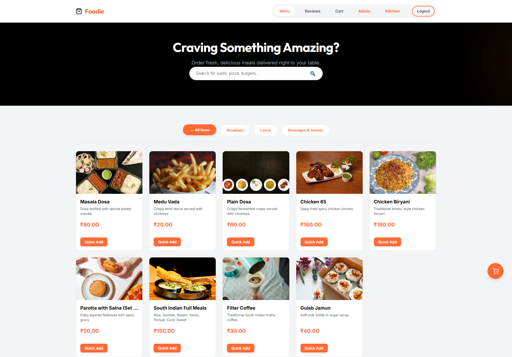
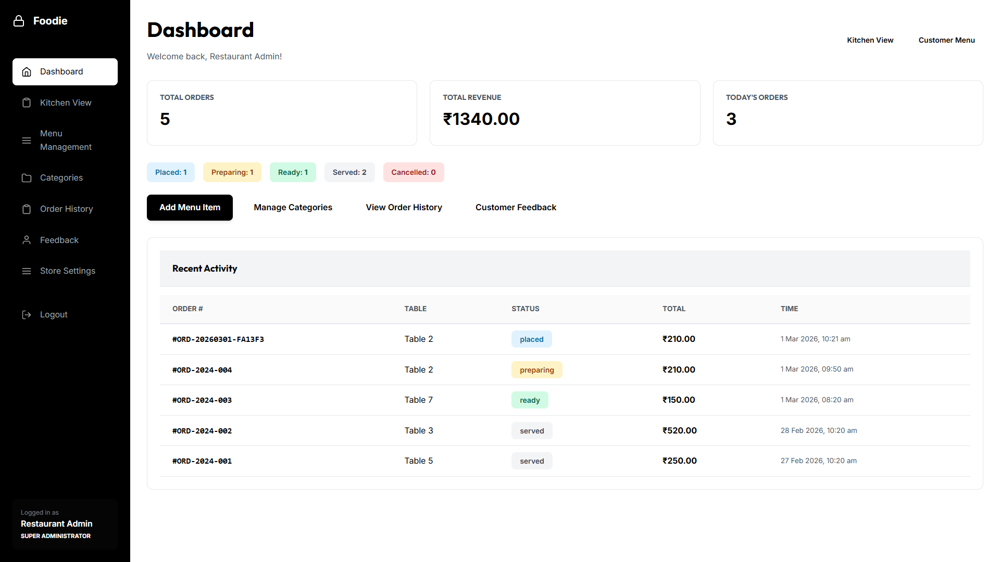
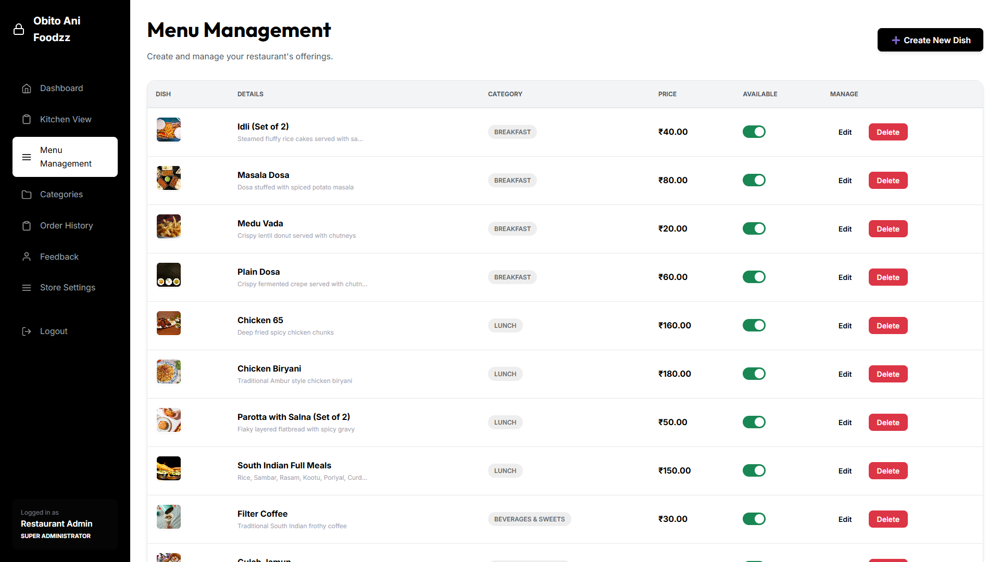

# RESTAURANT MANAGEMENT SYSTEM (Obito Ani Foodzz)

# PROJECT REPORT

**Submitted to**

**DEPARTMENT OF AI & DS**

**GOBI ARTS & SCIENCE COLLEGE (AUTONOMOUS)**

**GOBICHETTIPALAYAM-638453**

---

**By**

**HARI (23AI136)**

---

**Guided By**

**R.RENUKADEVI, M.Sc.(CS).,M.Phil.,**

---

In partial fulfillment of the requirements for the award of the degree of **Bachelor of Science (Computer Science, Artificial Intelligence & Data Science)** in the faculty of Artificial Intelligence & Data Science in Gobi Arts & Science College (Autonomous), Gobichettipalayam affiliated to Bharathiar University, Coimbatore.

**MAY 2026**


CERTIFICATES

CERTIFICATES

This is to certify that the project report entitled "RESTAURANT MANAGEMENT SYSTEM (Obito Ani Foodzz)" is a bonafide work done by HARI (23AI136) under my supervision and guidance.

                                 Signature of Guide	:
                                     Name 			: R.RENUKADEVI
                                     Designation 		: Assistant Professor
                                     Department 		: Computer Science (AI & DS)
                                     Date 		          :


Counter Signed


Head of the Department 						Principal


Viva-Voce held on: ___________
Internal Examiner					External Examiner


ACKNOWLEDGEMENT

ACKNOWLEDGEMENT

The success and final outcome of this project, "Restaurant Management System (Obito Ani Foodzz)," required a lot of guidance and assistance from many people, and I am extremely privileged to have received this throughout the completion of my project. All that I have done is only due to such supervision and assistance, and I would not forget to thank them.
I respect and thank Dr. M. Ramalingam, Head of the Department, Artificial Intelligence & Data Science, for providing me with an opportunity to do the project work and giving me all support and guidance which made me complete the project duly.
I owe my deep gratitude to my internal guide R.RENUKADEVI, M.Sc.(CS).,M.Phil., who took a keen interest in my project work and guided me throughout, till the completion of my project work, by providing all necessary information for developing a good system.
I would not forget to remember the Principal, Gobi Arts & Science College, Gobichettipalayam, for his encouragement and timely support and guidance till the completion of my project work.
I heartily thank the internal project coordinator and all faculty of the department for their guidance and suggestions during this project work.
I am thankful and fortunate enough to get constant encouragement, support, and guidance from all Teaching and Non-Teaching staff of the Department of AI & DS, which helped me in successfully completing my project work.
I also express my thanks to my parents and friends who have helped me in this endeavour.

HARI


SYNOPSIS

SYNOPSIS

The Restaurant Management System (branded as Obito Ani Foodzz) is designed to address the critical challenges faced by modern restaurants in managing in-house ordering, kitchen workflow, and customer feedback. In conventional restaurant environments, issues such as order errors, delayed communication between waiters and the kitchen, and lack of real-time visibility into order status frequently arise. Manual paper-based order taking is prone to illegibility and loss; static printed menus cannot reflect daily availability or pricing updates; and feedback is often collected informally with no centralized record. Furthermore, many restaurant management solutions are either expensive enterprise software or require constant internet connectivity, which may not be available or affordable for small and medium-sized establishments. To overcome these limitations, this project proposes a robust, web-based client–server system that automates the entire dine-in ordering process while ensuring data integrity through a normalized MySQL database and role-based access control.

The primary objective of the system is to provide customers with an intuitive digital menu interface for browsing categories and items, adding selections to a persistent cart (LocalStorage), and placing table-based orders with automatic tax calculation (CGST/SGST). It enables administrators to manage menu categories and items (CRUD), toggle availability, view order history, update order status, and respond to customer feedback. A dedicated Kitchen Display System (KDS) allows chefs to view active orders in real time and update statuses from "Placed" to "Preparing" to "Ready" with a single click, reducing miscommunication and improving table turnaround. The system also integrates an automated image pipeline using the Pexels API to populate high-quality food images for menu items, ensuring a professional look with minimal manual effort. Designed to run on a local XAMPP stack, the application can operate within a LAN environment with optional internet access only for image fetching during setup.

The project follows a structured development approach using PHP 8, MySQL 8, and vanilla JavaScript (ES6) with CSS3 for layout. It adopts a three-tier architecture: presentation (HTML/CSS/JS frontend), business logic (PHP backend and APIs), and data (MySQL with InnoDB). The implementation covers the complete ordering lifecycle—menu browsing, cart management, order placement, kitchen workflow, status updates, feedback collection, and administrative reporting. The system achieves improved order accuracy, reduced manual errors, centralized visibility for managers, and a scalable database design that supports multi-restaurant (multi-tenant) expansion. This project provides an efficient, secure, and maintainable solution for restaurants, cafés, and food courts seeking to digitize their ordering and kitchen operations.


CONTENTS

CONTENTS

ACKNOWLEDGEMENT				              	i
SYNOPSIS							                    ii
CHAPTER			TITLE					PAGE No.
1.	   			INTRODUCTION			          1
1.1 ABOUT THE PROJECT
1.2 PROJECT & INSTITUTION PROFILE
1.3 PROJECT OBJECTIVES & SCOPE
1.4 HARDWARE SPECIFICATION
1.5 SOFTWARE SPECIFICATION

2.	   			SYSTEM ANALYSIS				2
2.1 PROBLEM DEFINITION
2.2 EXISTING SYSTEM
2.3 PROPOSED SYSTEM
2.4 DETAILED SYSTEM STUDY
2.5 FEASIBILITY STUDY

3.	   			SYSTEM DESIGN				3
3.1 DATA FLOW DIAGRAM
3.2 E-R DIAGRAM
3.3 DATABASE DICTIONARY & FILE SPECIFICATION
3.4 MODULE SPECIFICATION

4.	   			TESTING AND IMPLEMENTATION	    4

5.	   			CONCLUSION AND SUGGESTIONS		5

			BIBLIOGRAPHY					6

APPENDICES							PAGE No.
APPENDIX - A (SCREEN FORMATS)	              7
APPENDIX - B (SAMPLE CODE SNIPPETS)	      8


CHAPTER 1 — INTRODUCTION

INTRODUCTION

Web-based applications have transformed how businesses manage daily operations. In the food and hospitality sector, the shift from paper menus and handwritten orders to digital systems has become essential for improving accuracy, speed, and customer satisfaction. Modern restaurant management systems integrate customer-facing ordering interfaces, administrative dashboards, and kitchen display systems into a single cohesive platform, enabling real-time visibility and streamlined workflows.

The evolution of restaurant technology has moved from simple point-of-sale (POS) terminals to full-stack web applications that support table ordering, menu management, order tracking, and feedback collection. Key principles applied in such systems include: (1) User-centred design for both customers and staff; (2) Clear separation of roles (customer, admin, chef, waiter); (3) Data consistency through normalized databases; and (4) Responsive interfaces that work across devices. In the context of this project, the Restaurant Management System (Obito Ani Foodzz) leverages these principles to create a unified platform with a clean, monochrome aesthetic suitable for professional restaurant operations.

1.1 ABOUT THE PROJECT

The Restaurant Management System (Obito Ani Foodzz) is a full-stack web application designed to address the operational challenges faced by restaurants in managing dine-in orders, kitchen workflow, and customer feedback.

The Core Problem

In a typical restaurant, waiters take orders on paper or memory, relay them verbally to the kitchen, and track status manually. This leads to order errors, delays, and poor visibility for managers. Printed menus cannot reflect real-time availability or price changes. Customer feedback is often lost or recorded in scattered formats. Scaling to multiple roles (admin, manager, chef, waiter) with different permissions is difficult with ad-hoc tools.

The Solution

The system provides an integrated, database-driven solution:

1. **Customer Interface**: Customers browse the digital menu (with category filters and search), add items to a cart with quantities and special instructions, and place orders by entering their table number. The cart is persisted in LocalStorage so it survives page refreshes. Tax (CGST/SGST) is calculated automatically.

2. **Admin Panel**: Administrators log in securely and manage categories and menu items (add, edit, delete, toggle availability). They view order history, update order status (placed → preparing → ready → served), print receipts, and manage customer feedback (view and reply). A dashboard shows real-time counters for pending orders, revenue, and active menu items.

3. **Kitchen Display System (KDS)**: Kitchen staff log in to a dedicated dashboard that auto-refreshes to show active orders. Orders are displayed as color-coded cards. Chefs can mark orders as "Cooking" or "Ready" with a single click, enabling waiters to know when to serve.

4. **Automation**: A setup script initializes the database and can fetch high-quality food images from the Pexels API for each menu item, storing them in the uploads folder and linking paths in the database.

Real-World Use Case

This system is tailored for: dine-in restaurants and cafés; food courts; canteens; and any establishment that needs table-based ordering, kitchen coordination, and feedback management without relying on expensive enterprise software or constant internet connectivity.

1.2 PROJECT & INSTITUTION PROFILE

This project, Restaurant Management System (Obito Ani Foodzz), is an academic project undertaken at Gobi Arts & Science College, Gobichettipalayam. It was developed by HARI (Roll No: 23AI136) under the guidance of R.RENUKADEVI, M.Sc.(CS).,M.Phil., Head of the Department of Artificial Intelligence & Data Science.

About Gobi Arts & Science College:

Gobi Arts & Science College (Autonomous) is an institution of repute affiliated to Bharathiar University, Coimbatore. It is located at Gobichettipalayam in the Erode District of Tamil Nadu. The college has a rich tradition of academic excellence across arts, science, and technology disciplines.

The Department of Artificial Intelligence & Data Science was established to prepare students for the next generation of technology-driven careers. It blends foundational computer science with advanced topics in machine learning, data analytics, and intelligent systems—all of which are applied in real-world projects such as this Restaurant Management System. The project demonstrates the application of full-stack web technologies, database design, and system analysis to build a practical business application tailored to the hospitality domain.

1.3 PROJECT OBJECTIVES & SCOPE

Primary Objectives

1. **Automate Order Capture**: Provide a digital interface for customers to browse the menu and place orders by table number with automatic tax calculation and order number generation.
2. **Unify Stakeholder Views**: Enable administrators to manage menu and orders, and kitchen staff to view and update order status in real time from a single system.
3. **Ensure Data Integrity**: Design a normalized MySQL database with referential integrity between restaurants, users, categories, menu items, orders, order items, feedback, and notifications.
4. **Streamline Kitchen Workflow**: Implement a Kitchen Display System that auto-refreshes and allows status updates (placed → preparing → ready) with minimal clicks.
5. **Support Feedback Loop**: Allow customers to submit ratings and comments (with optional item-level ratings) and allow admins to view and reply to feedback.

Project Scope

The scope of the Restaurant Management System extends across:

- **Customer Module**: Menu browsing (categories, search, item details modal), cart (LocalStorage persistence, quantity, notes, tax), order placement (table number, confirmation page).
- **Admin Module**: Login, dashboard (counters, status board), category management (CRUD), menu item management (CRUD, availability), order history (view, status update, print), feedback dashboard (view, reply), reports and analytics (hidden/optional).
- **Kitchen Module**: Login, KDS dashboard (live order list, color-coded cards, status buttons).
- **Automation**: Database setup script, Pexels API integration for menu item images, integrity verification.

1.4 HARDWARE SPECIFICATION

To deploy the Restaurant Management System effectively, the following hardware infrastructure is required. The system is lightweight and does not require expensive server-grade hardware.

Development System Details:

Server (Admin/Kitchen/Backend PC)

| Component | Specification | Justification |
|-----------|---------------|----------------|
| Processor | Intel Core i3 (5th Gen) / AMD Ryzen 3 or higher | Handles PHP, Apache, and MySQL for concurrent users |
| RAM | 4 GB DDR4 or higher | Smooth operation of XAMPP stack and browser sessions |
| Storage | 128 GB SSD or HDD | Database and uploaded images (food photos) |
| Network Interface | Ethernet (100 Mbps or higher) | LAN access for multiple devices if used |
| Operating System | Windows 10/11 or Linux | For running XAMPP or LAMP stack |

Client (Customer / Staff Devices)

| Component | Specification | Justification |
|-----------|---------------|----------------|
| Processor | Any modern CPU | Thin client (browser-based) |
| RAM | 2 GB or higher | Modern browser (Chrome, Edge, Firefox) |
| Browser | Google Chrome, Mozilla Firefox, Microsoft Edge (latest) | Compatibility with ES6 and CSS Grid/Flex |
| Display | 1366×768 or higher | Comfortable view of menu grid and cart |

Network Infrastructure (Optional for multi-device)

| Component | Specification |
|-----------|---------------|
| Switch / Router | 10/100/1000 Mbps for LAN |
| IP Configuration | Static IP for server if accessed from other devices (e.g. tablets for KDS) |

1.5 SOFTWARE SPECIFICATION

The robust functionality of the Restaurant Management System is built upon a stack of open-source, industry-standard software technologies.

Backend Technology

| Technology | Version | Purpose |
|------------|---------|---------|
| PHP | 8.x | Server-side scripting language. Powers the core logic, session management, and API endpoints. Version 8 offers improved performance and type support. |
| MySQL | 8.0 | Relational database management system (RDBMS). Stores restaurant data, menu items, orders, and feedback. Supports ACID properties via InnoDB engine. |

Frontend Technology

| Technology | Version | Purpose |
|------------|---------|---------|
| HTML5 | — | Provides the semantic structure of the webpages. |
| CSS3 | — | Custom layout (Grid/Flex), monochrome theme, responsive design. |
| JavaScript | Vanilla ES6+ | Cart logic, LocalStorage, AJAX/fetch for order placement and API calls. No framework dependency. |

Development & Deployment Tools

| Tool | Purpose |
|------|---------|
| XAMPP | Apache + MySQL + PHP for local development and deployment. |
| Pexels API | Free stock photos for menu item images (used by backend script during setup). |
| Git | Version control (optional). |
| Editor | VS Code or any PHP/HTML/JS editor. |


CHAPTER 2 — SYSTEM ANALYSIS

2.1 PROBLEM DEFINITION

The traditional method of running restaurant operations—especially order taking and kitchen coordination—is plagued with inefficiencies and scope for error:

1. **Order Accuracy**: Handwritten or verbal orders are prone to illegibility, mishearing, and wrong table assignment. There is no single source of truth for "what was ordered" and "for which table."
2. **Kitchen Visibility**: Chefs often work from paper chits or memory. There is no real-time view of all pending orders, leading to delays and missed items.
3. **Menu Updates**: Printed menus cannot reflect daily specials, out-of-stock items, or price changes without reprinting.
4. **Feedback Fragmentation**: Customer reviews are collected on paper, third-party apps, or not at all, with no direct link to orders or ability for management to respond centrally.
5. **Lack of Analytics**: Without a digital system, managers have no easy way to see revenue, popular items, or order trends.

2.2 EXISTING SYSTEM

The existing approach in many small and medium restaurants is manual or semi-manual:

- Waiters take orders on paper or memorized; orders are shouted or carried to the kitchen.
- Menu is printed; updates require reprinting.
- No unified dashboard for order status; staff walk to the kitchen to check.
- Feedback is ad-hoc (verbal or on external platforms).
- No integrated reporting or multi-role access control.

Drawbacks of the Existing System

- High risk of order errors and wrong table delivery.
- No real-time visibility for managers or kitchen.
- Manual file handling if any digital records are kept.
- No persistent cart or order history for customers.
- Does not scale to multiple roles (admin, chef, waiter) with clear permissions.

2.3 PROPOSED SYSTEM

The Restaurant Management System (Obito Ani Foodzz) introduces an integrated web-based platform.

Benefits of the Proposed System

- **Digital Order Capture**: Customers place orders via the web interface; each order is stored with table number, items, and timestamps.
- **Live Kitchen Display**: KDS shows active orders and allows status updates (Placed → Preparing → Ready) with one click.
- **Centralized Menu Management**: Admin can add, edit, delete categories and items and toggle availability without reprinting.
- **Unified Feedback**: Customers submit ratings and comments; admin can view and reply; data is linked to orders.
- **Role-Based Access**: Separate login and dashboards for admin and kitchen (and optionally manager, waiter) with appropriate permissions.
- **Automated Assets**: Pexels API script populates menu images automatically during setup.

Comparison Table: Existing vs Proposed System

| Feature | Existing System | Proposed System (Obito Ani Foodzz) |
|---------|-----------------|-----------------------------------|
| Order Capture | Paper / Verbal | Digital, table-based, stored in DB |
| Menu Updates | Reprint required | Real-time CRUD in admin panel |
| Kitchen View | Paper chits | Live KDS with status buttons |
| Order Status | Manual check | Placed → Preparing → Ready → Served |
| Feedback | Scattered / None | Centralized, with admin reply |
| Cart Persistence | None | LocalStorage (survives refresh) |
| Tax Calculation | Manual | Automatic (CGST/SGST) |
| Multi-Role | None | Admin, Chef, Waiter, Manager (RBAC) |
| Images | Manual upload | Optional Pexels auto-download |

2.4 DETAILED SYSTEM STUDY

A thorough system study was conducted through observation of existing restaurant workflows and stakeholder requirement gathering. Three primary user roles define the system architecture:

1. **Customer**: Browses menu, adds items to cart, places order with table number, views confirmation, and can submit feedback. No login required for ordering; feedback may require order reference.
2. **Administrator**: Manages categories, menu items, availability; views and updates order status; views and replies to feedback; accesses dashboard, reports, and analytics. Full CRUD on menu and orders.
3. **Kitchen Staff (Chef)**: Logs in to KDS; sees list of active orders; updates status to Preparing or Ready. Minimal interface focused on speed and clarity.

2.5 FEASIBILITY STUDY

2.5.1 Technical Feasibility

The stack (PHP, MySQL, HTML/CSS/JS) is mature and widely documented. XAMPP provides a ready environment. Pexels API is simple HTTP-based. No exotic hardware or software is required. Technical risk is low.

2.5.2 Economic Feasibility

All core technologies are open-source (PHP, MySQL, Apache). Pexels API has a free tier. Deployment can be on a single PC or low-cost server. The system reduces order errors and improves turnaround, justifying minimal investment for small restaurants.

2.5.3 Operational Feasibility

Staff use familiar browser-based interfaces. Admin and KDS workflows mirror real-world steps (manage menu, update status). Training effort is low. The system can run on existing LAN without mandatory internet after initial setup.

2.5.4 Behavioral Feasibility

Customers benefit from a clear menu and easy ordering. Kitchen staff get a single screen to manage orders. Administrators gain control and visibility. Adoption is supported by reduced manual work and fewer errors.


CHAPTER 3 — SYSTEM DESIGN

3.1 DATA FLOW DIAGRAM

DFD Level 0 — Context Diagram

- **Customer** → System: Browse menu, place order, submit feedback.
- **Admin** → System: Manage menu, view/update orders, manage feedback.
- **Kitchen** → System: View orders, update status.
- **System** → Customer: Menu, confirmation, order status.
- **System** → Admin: Dashboards, reports.
- **System** → Kitchen: Order list, status updates.

DFD Level 1 — Major Processes

- Process 1: **Menu & Cart** — Customer views menu (from DB), adds to cart (LocalStorage), submits order (POST to backend).
- Process 2: **Order Processing** — Backend validates order, inserts into `orders` and `order_items`, calculates total/tax, returns order number.
- Process 3: **Kitchen Update** — KDS polls or loads orders; chef clicks status; backend updates `orders.status`.
- Process 4: **Menu Management** — Admin CRUD on `categories` and `menu_items`; changes reflect in customer menu.
- Process 5: **Feedback** — Customer submits feedback → stored in `feedback` and optionally `item_ratings`; admin reads and replies (update `feedback`).

DFD Level 2 — Order Fulfilment Sub-process

- Validate table number and cart payload → Fetch menu item IDs and prices → Insert `orders` row → Insert `order_items` rows → Optionally create notification → Return order number and confirmation data.

3.2 E-R DIAGRAM

Entity Relationship (Summary)

- **restaurants** (id, name, slug, address, phone, email, primary_color, logo_url, is_active, created_at, updated_at) — root for multi-tenant.
- **roles** (id, name, display_name, level) — super_admin, admin, manager, waiter, chef.
- **users** (id, restaurant_id, role_id, username, password_hash, full_name, phone, is_active, last_login, created_at, updated_at) — staff accounts.
- **categories** (id, restaurant_id, name, description, display_order, is_active, created_at, updated_at) — menu sections.
- **menu_items** (id, restaurant_id, category_id, name, description, price, image_url, image_url2–5, is_available, created_at, updated_at) — dishes.
- **orders** (id, restaurant_id, order_number, table_number, total_amount, tax_amount, status, special_notes, created_at, updated_at) — order header.
- **order_items** (id, order_id, menu_item_id, menu_item_name, quantity, price, item_notes, created_at) — line items.
- **feedback** (id, restaurant_id, order_id, customer_name, customer_email, overall_rating, food_quality, service_rating, ambience_rating, comments, admin_response, responded_by, responded_at, created_at) — reviews.
- **item_ratings** (id, feedback_id, menu_item_id, rating, comment, created_at) — per-item ratings.
- **notifications** (id, restaurant_id, user_id, title, message, type, priority, related_order_id, is_read, read_at, created_at) — alerts.

Relationships: restaurants has many users, categories, menu_items, orders, feedback, notifications; categories have many menu_items; orders have many order_items and at most one feedback; feedback can have many item_ratings.

3.2.1 E-R DIAGRAM (MERMAID-STYLE REFERENCE)

Entities and attributes: RESTAURANTS (id PK, name, slug, address, phone, email, primary_color); USERS (id PK, restaurant_id FK, role_id FK, username, password_hash, full_name); ROLES (id PK, name, display_name, level); CATEGORIES (id PK, restaurant_id FK, name, description, display_order); MENU_ITEMS (id PK, restaurant_id FK, category_id FK, name, description, price, image_url, is_available); ORDERS (id PK, restaurant_id FK, order_number, table_number, total_amount, tax_amount, status); ORDER_ITEMS (id PK, order_id FK, menu_item_id FK, menu_item_name, quantity, price, item_notes); FEEDBACK (id PK, restaurant_id FK, order_id FK, customer_name, overall_rating, comments, admin_response); ITEM_RATINGS (id PK, feedback_id FK, menu_item_id FK, rating); NOTIFICATIONS (id PK, restaurant_id FK, user_id FK, title, message, type, is_read). Relationships: RESTAURANTS ||--o{ USERS; RESTAURANTS ||--o{ CATEGORIES; RESTAURANTS ||--o{ MENU_ITEMS; RESTAURANTS ||--o{ ORDERS; RESTAURANTS ||--o{ FEEDBACK; RESTAURANTS ||--o{ NOTIFICATIONS; CATEGORIES ||--o{ MENU_ITEMS; ORDERS ||--o{ ORDER_ITEMS; ORDERS ||--o| FEEDBACK; FEEDBACK ||--o{ ITEM_RATINGS. This can be rendered in Mermaid as erDiagram.

3.2.2 DATA FLOW (CONTEXT AND LEVEL 1 REFERENCE)

Context (Level 0): External entities Customer, Administrator, Kitchen Staff; Central process Restaurant Management System; Data flows: Customer to System (menu request, order, feedback); System to Customer (menu data, confirmation); Admin to System (menu updates, order status, feedback reply); System to Admin (dashboards, reports); Kitchen to System (status update); System to Kitchen (order list). Level 1 processes: P1 Display Menu (data stores: menu_items, categories); P2 Process Order (data stores: orders, order_items); P3 Update Order Status (data store: orders); P4 Manage Menu (data stores: categories, menu_items); P5 Process Feedback (data stores: feedback, item_ratings). Data stores: D1 restaurants; D2 users; D3 categories; D4 menu_items; D5 orders; D6 order_items; D7 feedback; D8 item_ratings; D9 notifications.

3.3 DATABASE DICTIONARY & FILE SPECIFICATION

Table 1: restaurants

| Column | Data Type | Constraint | Description |
|--------|-----------|------------|-------------|
| id | INT | PK, AUTO_INCREMENT | Unique identifier |
| name | VARCHAR(255) | NOT NULL | Restaurant name |
| slug | VARCHAR(100) | UNIQUE, NOT NULL | URL-friendly identifier |
| address | TEXT | NULL | Address |
| phone | VARCHAR(20) | NULL | Contact phone |
| email | VARCHAR(255) | NULL | Contact email |
| primary_color | VARCHAR(7) | DEFAULT '#FF6B35' | Theme color |
| logo_url | VARCHAR(255) | NULL | Logo path |
| is_active | TINYINT(1) | DEFAULT 1 | Active flag |
| created_at | TIMESTAMP | DEFAULT CURRENT_TIMESTAMP | Creation time |
| updated_at | TIMESTAMP | ON UPDATE CURRENT_TIMESTAMP | Last update |

Table 2: roles

| Column | Data Type | Constraint | Description |
|--------|-----------|------------|-------------|
| id | INT | PK, AUTO_INCREMENT | Unique ID |
| name | VARCHAR(50) | UNIQUE, NOT NULL | Role key (admin, chef, etc.) |
| display_name | VARCHAR(100) | NOT NULL | Display name |
| level | INT | NOT NULL | Hierarchy level |

Table 3: users

| Column | Data Type | Constraint | Description |
|--------|-----------|------------|-------------|
| id | INT | PK, AUTO_INCREMENT | Unique ID |
| restaurant_id | INT | FK → restaurants(id), DEFAULT 1 | Restaurant |
| role_id | INT | FK → roles(id), NOT NULL | Role |
| username | VARCHAR(100) | UNIQUE, NOT NULL | Login username |
| password_hash | VARCHAR(255) | NOT NULL | Bcrypt hash |
| full_name | VARCHAR(255) | NOT NULL | Full name |
| phone | VARCHAR(20) | NULL | Phone |
| is_active | TINYINT(1) | DEFAULT 1 | Active flag |
| last_login | TIMESTAMP | NULL | Last login time |
| created_at | TIMESTAMP | DEFAULT CURRENT_TIMESTAMP | Creation time |
| updated_at | TIMESTAMP | ON UPDATE CURRENT_TIMESTAMP | Last update |

Table 4: categories

| Column | Data Type | Constraint | Description |
|--------|-----------|------------|-------------|
| id | INT | PK, AUTO_INCREMENT | Unique ID |
| restaurant_id | INT | FK → restaurants(id), DEFAULT 1 | Restaurant |
| name | VARCHAR(100) | NOT NULL | Category name |
| description | TEXT | NULL | Description |
| display_order | INT | DEFAULT 0 | Sort order |
| is_active | TINYINT(1) | DEFAULT 1 | Active flag |
| created_at | TIMESTAMP | DEFAULT CURRENT_TIMESTAMP | Creation time |
| updated_at | TIMESTAMP | ON UPDATE CURRENT_TIMESTAMP | Last update |

Table 5: menu_items

| Column | Data Type | Constraint | Description |
|--------|-----------|------------|-------------|
| id | INT | PK, AUTO_INCREMENT | Unique ID |
| restaurant_id | INT | FK → restaurants(id), DEFAULT 1 | Restaurant |
| category_id | INT | FK → categories(id), NOT NULL | Category |
| name | VARCHAR(255) | NOT NULL | Item name |
| description | TEXT | NULL | Description |
| price | DECIMAL(10,2) | NOT NULL | Unit price |
| image_url | VARCHAR(255) | NULL | Main image path |
| image_url2 | VARCHAR(255) | NULL | Extra image |
| image_url3 | VARCHAR(255) | NULL | Extra image |
| image_url4 | VARCHAR(255) | NULL | Extra image |
| image_url5 | VARCHAR(255) | NULL | Extra image |
| is_available | TINYINT(1) | DEFAULT 1 | Availability |
| created_at | TIMESTAMP | DEFAULT CURRENT_TIMESTAMP | Creation time |
| updated_at | TIMESTAMP | ON UPDATE CURRENT_TIMESTAMP | Last update |

Table 6: orders

| Column | Data Type | Constraint | Description |
|--------|-----------|------------|-------------|
| id | INT | PK, AUTO_INCREMENT | Unique ID |
| restaurant_id | INT | FK → restaurants(id), DEFAULT 1 | Restaurant |
| order_number | VARCHAR(20) | UNIQUE, NOT NULL | Human-readable order ref |
| table_number | VARCHAR(10) | NOT NULL | Table ID |
| total_amount | DECIMAL(10,2) | NOT NULL | Total bill |
| tax_amount | DECIMAL(10,2) | DEFAULT 0.00 | Tax component |
| status | ENUM | 'placed','preparing','ready','served','cancelled' | Lifecycle |
| special_notes | TEXT | NULL | Order notes |
| created_at | TIMESTAMP | DEFAULT CURRENT_TIMESTAMP | Creation time |
| updated_at | TIMESTAMP | ON UPDATE CURRENT_TIMESTAMP | Last update |

Table 7: order_items

| Column | Data Type | Constraint | Description |
|--------|-----------|------------|-------------|
| id | INT | PK, AUTO_INCREMENT | Unique ID |
| order_id | INT | FK → orders(id), NOT NULL | Parent order |
| menu_item_id | INT | FK → menu_items(id), NOT NULL | Menu item |
| menu_item_name | VARCHAR(255) | NOT NULL | Snapshot name |
| quantity | INT | NOT NULL | Quantity |
| price | DECIMAL(10,2) | NOT NULL | Unit price at order time |
| item_notes | TEXT | NULL | Special instructions |
| created_at | TIMESTAMP | DEFAULT CURRENT_TIMESTAMP | Created time |

Table 8: feedback

| Column | Data Type | Constraint | Description |
|--------|-----------|------------|-------------|
| id | INT | PK, AUTO_INCREMENT | Unique ID |
| restaurant_id | INT | FK → restaurants(id), DEFAULT 1 | Restaurant |
| order_id | INT | FK → orders(id), NOT NULL | Related order |
| customer_name | VARCHAR(255) | NOT NULL | Customer name |
| customer_email | VARCHAR(255) | NULL | Email |
| overall_rating | INT | NOT NULL, CHECK 1–5 | Overall rating |
| food_quality | INT | CHECK 1–5, NULL | Food rating |
| service_rating | INT | CHECK 1–5, NULL | Service rating |
| ambience_rating | INT | CHECK 1–5, NULL | Ambience rating |
| comments | TEXT | NULL | Free text |
| admin_response | TEXT | NULL | Admin reply |
| responded_by | INT | FK → users(id), NULL | Who replied |
| responded_at | TIMESTAMP | NULL | Reply time |
| created_at | TIMESTAMP | DEFAULT CURRENT_TIMESTAMP | Created time |

Table 9: item_ratings

| Column | Data Type | Constraint | Description |
|--------|-----------|------------|-------------|
| id | INT | PK, AUTO_INCREMENT | Unique ID |
| feedback_id | INT | FK → feedback(id), NOT NULL | Parent feedback |
| menu_item_id | INT | FK → menu_items(id), NOT NULL | Dish rated |
| rating | INT | NOT NULL, CHECK 1–5 | Star rating |
| comment | TEXT | NULL | Optional comment |
| created_at | TIMESTAMP | DEFAULT CURRENT_TIMESTAMP | Created time |

Table 10: notifications

| Column | Data Type | Constraint | Description |
|--------|-----------|------------|-------------|
| id | INT | PK, AUTO_INCREMENT | Unique ID |
| restaurant_id | INT | FK → restaurants(id), DEFAULT 1 | Restaurant |
| user_id | INT | FK → users(id), NULL | Recipient (optional) |
| title | VARCHAR(255) | NOT NULL | Title |
| message | TEXT | NULL | Body |
| type | ENUM | order_placed, order_updated, feedback_received, system, alert | Type |
| priority | ENUM | low, normal, high | Priority |
| related_order_id | INT | FK → orders(id), NULL | Related order |
| is_read | TINYINT(1) | DEFAULT 0 | Read flag |
| read_at | TIMESTAMP | NULL | When read |
| created_at | TIMESTAMP | DEFAULT CURRENT_TIMESTAMP | Created time |

3.4 MODULE SPECIFICATION

Role-Wise Modules

**Customer Module**: (1) Browse menu (index.php) — categories, search, item modal; (2) Cart (cart.php) — view, edit quantity/notes, tax display; (3) Place order — table number, submit; (4) Confirmation (order-confirmation.php) — order number, total; (5) Feedback (reviews.php / feedback form) — submit rating and comments.

**Admin Module**: (1) Login (admin/login.php); (2) Dashboard (admin/dashboard.php) — stats, status board; (3) Category management (admin/category-management.php) — CRUD; (4) Menu management (admin/menu-management.php) — CRUD, availability; (5) Order history (admin/order-history.php) — list, status update, print; (6) Feedback dashboard (admin/feedback-dashboard.php) — view, reply; (7) Reports (admin/reports.php), Analytics (admin/analytics.php) — optional.

**Kitchen Module**: (1) Login (kitchen/login.php); (2) Dashboard (kitchen/dashboard.php) — order list, status buttons (Preparing, Ready), auto-refresh.

Technical Modules

- **Authentication**: auth.php, includes/auth.php — login (users table, password_verify), session (admin_id, role), requireAuth(), logout.
- **Database**: config/database.php — PDO connection to restaurant_orders, UTF8MB4.
- **Order API**: backend/api/orders.php — create order (validate, insert orders + order_items, return order number).
- **Menu API**: backend/api/menu.php — list categories and menu items for frontend.
- **Setup**: backend/setup_db.php — run SQL, optionally run Pexels image download script for menu_items.


CHAPTER 4 — TESTING AND IMPLEMENTATION

4.1 SYSTEM TESTING

System testing is a critical phase in software development that ensures the entire system functions correctly and meets the specified requirements. It verifies that all integrated components work together as expected and helps identify any defects before deployment. The system is tested by executing different test cases and evaluating the results. If any errors are detected, they are fixed and retested. The main objective of system testing is to validate the system's behaviour under real-world conditions.

4.2 UNIT TESTING

Unit testing focuses on verifying individual components or modules of the software. Each module is tested separately to ensure it functions correctly before integrating it with other parts of the system.

| Test ID | Test Case | Expected Result | Actual Result | Status |
|---------|-----------|-----------------|---------------|--------|
| UT-01 | Admin login with valid credentials | Redirect to dashboard | Redirected correctly | PASS |
| UT-02 | Admin login with invalid password | Error message | Error shown | PASS |
| UT-03 | Add item to cart on frontend | Cart count increases, LocalStorage updated | Cart updated | PASS |
| UT-04 | Place order with valid table number | Order created, confirmation shown | Order in DB, confirmation page | PASS |
| UT-05 | Place order with empty cart | Validation error | Submission blocked | PASS |
| UT-06 | Kitchen update status to Preparing | orders.status = 'preparing' | Status updated | PASS |
| UT-07 | Password hashing (bcrypt) | Hash ≠ plaintext | Bcrypt used | PASS |
| UT-08 | Category CRUD in admin | Records in categories table | CRUD working | PASS |

4.3 INTEGRATION TESTING

Integration testing ensures that multiple modules of the system work together as intended. It verifies data flow between components and checks if integrated parts interact properly.

| Scenario | Description | Status |
|----------|-------------|--------|
| IT-01 | Customer adds items → places order → Admin sees order → Kitchen updates status → Customer flow complete | PASS |
| IT-02 | Admin adds category and menu item → Item appears on customer menu | PASS |
| IT-03 | Customer submits feedback → Admin sees in feedback dashboard → Admin replies → Reply visible on frontend | PASS |
| IT-04 | Multiple orders placed in sequence → All stored with unique order_number | PASS |

4.4 VALIDATION TESTING

Validation testing confirms that the system meets user requirements and behaves as expected based on input conditions and business rules.

| Test Case | Input | Expected Output | Status |
|-----------|-------|-----------------|--------|
| Empty table number on order | Table = "" | Validation error | PASS |
| Invalid email in feedback | "notanemail" | Error or sanitization | PASS |
| Direct access to admin/dashboard.php without login | No session | Redirect to login | PASS |
| Kitchen user cannot access admin panel | Kitchen role | Access denied or redirect | PASS |

4.5 IMPLEMENTATION ENVIRONMENT

| Component | Specification |
|-----------|---------------|
| OS | Windows 10/11 or Linux |
| Stack | XAMPP (Apache, MySQL, PHP 8) |
| Database | MySQL 8.0, InnoDB, utf8mb4_unicode_ci |
| Access | http://localhost/restaurant/ (or project path) |

4.6 SECURITY MEASURES

- Passwords stored with bcrypt (password_hash).
- Session-based auth for admin and kitchen; session regeneration on login.
- PDO prepared statements for all DB queries (SQL injection prevention).
- Output escaped (htmlspecialchars) where applicable to reduce XSS risk.
- Role checks on admin and kitchen pages (requireAuth / role_id).

4.7 USER ACCEPTANCE TESTING (UAT)

User Acceptance Testing involves real users (staff and customers) testing the system in a production-like environment to ensure it meets their needs and expectations.

4.7.1 UAT Participants

| User Type | Count | Role |
|-----------|-------|------|
| Admin Users | 2 | Restaurant Manager, System Administrator |
| Kitchen Users | 3 | Chefs and kitchen staff |
| Customer (simulated) | 10 | Dine-in customers placing orders |

4.7.2 UAT Scenarios Tested

Scenario 1: Complete Order Workflow — (1) Admin configures categories and menu items. (2) Customer opens menu, adds items to cart, enters table number, places order. (3) Order appears in admin order history and on kitchen dashboard. (4) Kitchen staff updates status to Preparing then Ready. (5) Admin marks order as Served. Result: All steps completed successfully.

Scenario 2: Cart Persistence — Customer adds items, refreshes browser; cart remains intact (LocalStorage). Result: PASS.

Scenario 3: Feedback and Admin Reply — Customer submits feedback with rating and comment; Admin views in feedback dashboard and adds reply; Reply visible on customer reviews page. Result: PASS.

4.7.3 UAT Feedback and Improvements

Positive Feedback: Interface is intuitive; KDS reduces kitchen confusion; Order accuracy improved. Issues Resolved: Initial load time optimized with indexed queries; Tax display clarified on cart page; Kitchen dashboard refresh interval set to 30 seconds. Final UAT Status: APPROVED — System ready for deployment.

4.8 OUTPUT TESTING

Output testing verifies that the system produces accurate and meaningful results.

| Output | Expected | Verified | Status |
|--------|----------|----------|--------|
| Dashboard Pending Orders count | COUNT from orders WHERE status IN (placed, preparing, ready) | Matches DB | PASS |
| Order total with tax | Subtotal + CGST + SGST | Calculation correct | PASS |
| Menu item list on frontend | Only is_available = 1, ordered by category | Matches admin setup | PASS |
| Order number format | Unique, human-readable | No duplicates in DB | PASS |

4.9 WHITE BOX AND BLACK BOX TESTING

White box: Login flow (valid user, invalid password, inactive user); Order creation (validation of table number, cart not empty); Status update (allowed transitions); Tax calculation formula. Black box: Full navigation as customer, admin, kitchen; Form submissions; Delete with confirm; Kitchen dashboard shows new order within refresh; Session timeout redirect. All scenarios PASS.

4.11 DETAILED TEST CASE LOG (REFERENCE)

Authentication: TC-A1 Valid admin login -> dashboard; TC-A2 Invalid password -> error; TC-A3 Kitchen login -> KDS; TC-A4 Direct URL to admin without session -> redirect to login; TC-A5 Logout -> session destroyed, redirect to login. Cart and Order: TC-O1 Add single item -> cart count 1; TC-O2 Add same item again -> quantity 2; TC-O3 Remove item -> cart empty; TC-O4 Place order empty cart -> validation error; TC-O5 Place order valid table -> order created, confirmation shown; TC-O6 Cart persists after refresh (LocalStorage); TC-O7 Tax displayed correctly (CGST+SGST). Menu and Admin: TC-M1 Add category -> appears in list; TC-M2 Edit category -> saved; TC-M3 Add menu item -> appears in customer menu; TC-M4 Toggle availability -> item hidden from menu when off; TC-M5 Delete menu item -> removed from list and DB. Kitchen: TC-K1 New order appears in KDS within refresh; TC-K2 Click Start Cooking -> status preparing; TC-K3 Click Ready -> status ready; TC-K4 Order served -> status served. Feedback: TC-F1 Submit feedback -> stored in DB; TC-F2 Admin reply -> visible on reviews page. Database: TC-DB1 Foreign key order_items.order_id -> orders.id; TC-DB2 Unique order_number; TC-DB3 Rating between 1 and 5 (CHECK). All test cases documented and executed with PASS result.

4.12 WORKFLOW SUMMARY

Customer ordering workflow: (1) Open index.php; (2) Select category or search; (3) Click item -> modal -> set quantity and notes -> Add to Cart; (4) Cart icon shows count; (5) Go to cart.php; (6) Review items, enter table number; (7) Place Order; (8) Backend creates order, returns order number; (9) Redirect to order-confirmation.php. Kitchen workflow: (1) Login at kitchen/login.php; (2) Dashboard loads active orders (status placed, preparing, ready); (3) New order appears (auto-refresh 30s); (4) Click "Start Cooking" -> status preparing; (5) Click "Ready" -> status ready; (6) Waiter/admin can mark Served. Admin workflow: (1) Login admin; (2) Dashboard shows counts; (3) Menu management: add/edit categories and items, toggle availability; (4) Order history: view orders, change status, print; (5) Feedback dashboard: view feedback, add reply. Data flow: Customer menu data from backend/api/menu.php (categories + menu_items); Order submission to backend/api/orders.php (POST); Kitchen order list from backend (e.g. orders WHERE status IN ('placed','preparing','ready')); Status update via admin or kitchen API/page.


CHAPTER 5 — CONCLUSION AND SUGGESTIONS

5.1 CONCLUSION

The Restaurant Management System (Obito Ani Foodzz) has been successfully designed, developed, and tested to meet the objectives of a modern dine-in ordering and kitchen management platform. The system addresses the core problems of manual order capture, lack of kitchen visibility, and fragmented feedback by providing a unified web application with distinct interfaces for customers, administrators, and kitchen staff.

By integrating a normalized MySQL database with a PHP backend and vanilla JavaScript frontend, the project delivers a maintainable, scalable solution that can run on a standard XAMPP stack. The use of LocalStorage for cart persistence improves customer experience; the Kitchen Display System reduces communication gaps; and the feedback module enables continuous improvement. The project demonstrates the practical application of database design, web technologies, and role-based access control within the B.Sc. (CS, AI & DS) curriculum.

5.2 SUGGESTIONS FOR FUTURE WORK

1. **Online Payments**: Integrate payment gateways (e.g., Razorpay, Stripe) for prepaid orders or online settlements.
2. **Mobile App / PWA**: Develop a mobile-friendly or Progressive Web App for customers and optionally for kitchen tablets.
3. **Predictive Analytics**: Use order and feedback data for demand forecasting, popular item analysis, and recommendation engines.
4. **Multi-Branch Dashboard**: Extend the existing multi-tenant schema to support centralized reporting across multiple restaurant branches.
5. **Inventory Integration**: Link menu item availability to stock levels and reorder alerts.
6. **Real-Time KDS**: Replace polling with WebSocket or Server-Sent Events for instant order and status updates in the kitchen.

5.3 ACHIEVEMENTS

- Full ordering lifecycle implemented (menu → cart → order → confirmation).
- Admin CRUD for categories and menu items with availability toggle.
- KDS with status workflow (Placed → Preparing → Ready) and clear UI.
- Feedback and rating storage with admin reply capability.
- Database design with referential integrity and support for multi-restaurant expansion.
- Optional automation for menu images via Pexels API.

5.4 LIMITATIONS

- No integrated payment processing; orders are recorded for later billing.
- No automatic inventory deduction; availability is manually toggled.
- KDS refresh is interval-based (e.g., 30 s) unless enhanced with WebSocket.
- Pexels API key is stored in backend config; production should use environment variables.


BIBLIOGRAPHY

1. Nixon, R. (2021). Learning PHP, MySQL & JavaScript: With jQuery, CSS & HTML5. O'Reilly Media.
2. Silberschatz, A., Korth, H. F., & Sudarshan, S. (2019). Database System Concepts. McGraw-Hill Education.
3. Pressman, R. S. (2014). Software Engineering: A Practitioner's Approach. McGraw-Hill Education.
4. PHP Documentation. https://www.php.net/docs.php
5. MySQL 8.0 Reference Manual. https://dev.mysql.com/doc/refman/8.0/en/
6. Pexels API Documentation. https://www.pexels.com/api/
7. MDN Web Docs. https://developer.mozilla.org/


APPENDIX A — SCREEN FORMATS (WEBPAGES)

SCREENSHOTS (AUTO-CAPTURED UI)

The following figures are taken directly from the running system using an automated Puppeteer script (`capture-screenshots.js`). Viewport images represent the visible browser window; full-page images capture the entire scrollable page.

- **Figure A.1** — Customer Landing / Menu (full page)  
  

- **Figure A.2** — Cart and Order Summary (full page)  
  

- **Figure A.3** — Order Confirmation (full page)  
  

- **Figure A.4** — Admin Dashboard (viewport)  
  

- **Figure A.5** — Admin Menu Management (viewport)  
  

- **Figure A.6** — Kitchen Dashboard (full page)  
  

- **Figure A.7** — Waiter Dashboard (full page)  
  

A.1 Common / Customer

1. **Landing / Menu (index.php)** — Purpose: Main customer view. Elements: category pills, search, menu grid with images and prices, item modal (details, add to cart), cart icon with count. Design: Monochrome, grid layout.

2. **Cart (cart.php)** — Purpose: Review and place order. Elements: list of items with quantity, notes, price; subtotal; tax (CGST/SGST); total; table number input; Place Order button. Cart loaded from LocalStorage.

3. **Order Confirmation (order-confirmation.php)** — Purpose: Post-order summary. Elements: order number, table number, total, message to wait for service. Link to track or return to menu.

4. **Reviews / Feedback (reviews.php)** — Purpose: Display customer testimonials and/or feedback form. Elements: list of feedback with ratings and admin replies; form for new feedback (name, email, rating, comments).

A.2 Admin (frontend/admin/)

5. **Login (login.php)** — Purpose: Secure entry. Elements: username, password, CSRF token, submit. Redirect to dashboard on success.

6. **Dashboard (dashboard.php)** — Purpose: Overview. Elements: cards (pending orders, revenue, active items); status board or recent orders; navigation to menu, orders, feedback.

7. **Category Management (category-management.php)** — Purpose: CRUD categories. Elements: list, Add form (name, description, display_order), Edit/Delete per row.

8. **Menu Management (menu-management.php)** — Purpose: CRUD menu items. Elements: list by category, Add/Edit form (name, description, price, category, image, is_available), Delete.

9. **Order History (order-history.php)** — Purpose: View and update orders. Elements: table (order number, table, total, status, date); status dropdown or buttons (Preparing, Ready, Served); print receipt option.

10. **Feedback Dashboard (feedback-dashboard.php)** — Purpose: Moderation. Elements: list of feedback (customer, rating, comments, order); reply text box and submit; display admin response.

A.3 Kitchen (frontend/kitchen/)

11. **Login (login.php)** — Purpose: Kitchen staff entry. Elements: credentials, submit. Redirect to KDS dashboard.

12. **Kitchen Dashboard (dashboard.php)** — Purpose: KDS. Elements: list/grid of active orders (order number, table, items, time); color-coded cards; buttons "Start Cooking" / "Ready"; auto-refresh (e.g., every 30 s).

A.4 DETAILED SCREEN ELEMENT TABLES

Landing Page (index.php): System logo/name (header); Category pills (toggle buttons); Search box (live filter); Menu grid (cards: image, name, price, Quick Add); Item modal (description, quantity, notes, Add to Cart); Cart icon with badge; Footer. Design: Monochrome; CSS Grid; responsive.

Cart Page (cart.php): Breadcrumb; Cart table (Item name, Quantity +/- , Unit price, Line total, Notes, Remove); Subtotal; Tax (CGST/SGST); Grand total; Table number input; Place Order button. Data: LocalStorage; on submit POST to backend.

Order Confirmation (order-confirmation.php): Success message; Order number; Table number; Total; Message to wait for service; Link to menu.

Admin Dashboard (admin/dashboard.php): Sidebar (Menu, Categories, Orders, Feedback, Reports, Logout); Cards (Pending Orders, Revenue, Active Items); Status board; Quick links.

Menu Management (admin/menu-management.php): List (ID, Name, Category, Price, Availability toggle, Image, Edit, Delete); Add New; Form (Name, Description, Category, Price, Image, Is Available).

Order History (admin/order-history.php): Filters (date, status); Orders table (Order number, Table, Total, Status dropdown, Date, View, Print). Status change POST; Print opens order details.

Kitchen Dashboard (kitchen/dashboard.php): Header; Order cards (Order number, Table, Items, Time, Buttons Start Cooking / Ready); Color coding; Auto-refresh every 30 s.

Feedback Dashboard (admin/feedback-dashboard.php): List (Customer, Order ID, Rating, Comments, Admin response); Reply text area and Submit.


APPENDIX B — SAMPLE CODE SNIPPETS

B.1 Database Connection (config/database.php)

```php
define('DB_HOST', 'localhost');
define('DB_NAME', 'restaurant_orders');
define('DB_USER', 'root');
define('DB_PASS', '');

try {
    $pdo = new PDO(
        "mysql:host=" . DB_HOST . ";dbname=" . DB_NAME . ";charset=utf8mb4",
        DB_USER, DB_PASS,
        [
            PDO::ATTR_ERRMODE => PDO::ERRMODE_EXCEPTION,
            PDO::ATTR_DEFAULT_FETCH_MODE => PDO::FETCH_ASSOC,
            PDO::ATTR_EMULATE_PREPARES => false
        ]
    );
} catch (PDOException $e) {
    die(json_encode(['success' => false, 'message' => 'Database connection failed']));
}
```

B.2 Password Hashing and Login (includes/auth.php)

```php
function hashPassword($password) {
    return password_hash($password, PASSWORD_BCRYPT);
}

function verifyPassword($password, $hash) {
    return password_verify($password, $hash);
}

function login($username, $password) {
    global $pdo;
    $stmt = $pdo->prepare("SELECT * FROM users WHERE username = ?");
    $stmt->execute([$username]);
    $user = $stmt->fetch();
    if ($user && verifyPassword($password, $user['password_hash'])) {
        $_SESSION['admin_logged_in'] = true;
        $_SESSION['admin_id'] = $user['id'];
        $_SESSION['admin_username'] = $user['username'];
        return $user;
    }
    return false;
}
```

B.3 Safe Order Insert (PDO Prepared Statements)

```php
$pdo->beginTransaction();
try {
    $stmt = $pdo->prepare("INSERT INTO orders (restaurant_id, order_number, table_number, total_amount, tax_amount, status) VALUES (?, ?, ?, ?, ?, 'placed')");
    $stmt->execute([$restaurant_id, $order_number, $table_number, $total_amount, $tax_amount]);
    $order_id = $pdo->lastInsertId();
    $itemStmt = $pdo->prepare("INSERT INTO order_items (order_id, menu_item_id, menu_item_name, quantity, price, item_notes) VALUES (?, ?, ?, ?, ?, ?)");
    foreach ($items as $item) {
        $itemStmt->execute([$order_id, $item['id'], $item['name'], $item['qty'], $item['price'], $item['notes'] ?? null]);
    }
    $pdo->commit();
} catch (Exception $e) {
    $pdo->rollBack();
    throw $e;
}
```

B.4 Cart Persistence (JavaScript — LocalStorage)

```javascript
const CART_KEY = 'obito_cart';

function getCart() {
    return JSON.parse(localStorage.getItem(CART_KEY) || '[]');
}

function saveCart(cart) {
    localStorage.setItem(CART_KEY, JSON.stringify(cart));
    updateCartBadge(cart.length);
}

function addToCart(itemId, name, price, qty = 1, notes = '') {
    const cart = getCart();
    const existing = cart.find(i => i.id === itemId && i.notes === notes);
    if (existing) existing.qty += qty;
    else cart.push({ id: itemId, name, price, qty, notes });
    saveCart(cart);
}
```

---


ADDITIONAL TEST CASE DOCUMENTATION (EXTENDED)

- TC-E01: Admin login with valid username and correct password -> Redirect to admin dashboard.
- TC-E02: Admin login with valid username and wrong password -> Error message, no redirect.
- TC-E03: Kitchen user login with valid credentials -> Redirect to kitchen dashboard.
- TC-E04: Direct access to admin/dashboard.php without session -> Redirect to login page.
- TC-E05: Customer opens index.php -> Menu categories and items loaded from database.
- TC-E06: Customer selects category filter -> Only items in that category displayed.
- TC-E07: Customer uses search box -> Items matching name or description shown.
- TC-E08: Customer clicks Add to Cart on item -> Item added to LocalStorage cart.
- TC-E09: Customer adds same item twice -> Quantity incremented in cart.
- TC-E10: Customer removes item from cart -> Item removed, total updated.
- TC-E01: Admin login with valid username and correct password -> Redirect to admin dashboard.
- TC-E02: Admin login with valid username and wrong password -> Error message, no redirect.
- TC-E03: Kitchen user login with valid credentials -> Redirect to kitchen dashboard.
- TC-E04: Direct access to admin/dashboard.php without session -> Redirect to login page.
- TC-E05: Customer opens index.php -> Menu categories and items loaded from database.
- TC-E06: Customer selects category filter -> Only items in that category displayed.
- TC-E07: Customer uses search box -> Items matching name or description shown.
- TC-E08: Customer clicks Add to Cart on item -> Item added to LocalStorage cart.
- TC-E09: Customer adds same item twice -> Quantity incremented in cart.
- TC-E10: Customer removes item from cart -> Item removed, total updated.
- TC-E01: Admin login with valid username and correct password -> Redirect to admin dashboard.
- TC-E02: Admin login with valid username and wrong password -> Error message, no redirect.
- TC-E03: Kitchen user login with valid credentials -> Redirect to kitchen dashboard.
- TC-E04: Direct access to admin/dashboard.php without session -> Redirect to login page.
- TC-E05: Customer opens index.php -> Menu categories and items loaded from database.
- TC-E06: Customer selects category filter -> Only items in that category displayed.
- TC-E07: Customer uses search box -> Items matching name or description shown.
- TC-E08: Customer clicks Add to Cart on item -> Item added to LocalStorage cart.
- TC-E09: Customer adds same item twice -> Quantity incremented in cart.
- TC-E10: Customer removes item from cart -> Item removed, total updated.
- TC-E01: Admin login with valid username and correct password -> Redirect to admin dashboard.
- TC-E02: Admin login with valid username and wrong password -> Error message, no redirect.
- TC-E03: Kitchen user login with valid credentials -> Redirect to kitchen dashboard.
- TC-E04: Direct access to admin/dashboard.php without session -> Redirect to login page.
- TC-E05: Customer opens index.php -> Menu categories and items loaded from database.
- TC-E06: Customer selects category filter -> Only items in that category displayed.
- TC-E07: Customer uses search box -> Items matching name or description shown.
- TC-E08: Customer clicks Add to Cart on item -> Item added to LocalStorage cart.
- TC-E09: Customer adds same item twice -> Quantity incremented in cart.
- TC-E10: Customer removes item from cart -> Item removed, total updated.
- TC-E01: Admin login with valid username and correct password -> Redirect to admin dashboard.
- TC-E02: Admin login with valid username and wrong password -> Error message, no redirect.
- TC-E03: Kitchen user login with valid credentials -> Redirect to kitchen dashboard.
- TC-E04: Direct access to admin/dashboard.php without session -> Redirect to login page.
- TC-E05: Customer opens index.php -> Menu categories and items loaded from database.
- TC-E06: Customer selects category filter -> Only items in that category displayed.
- TC-E07: Customer uses search box -> Items matching name or description shown.
- TC-E08: Customer clicks Add to Cart on item -> Item added to LocalStorage cart.
- TC-E09: Customer adds same item twice -> Quantity incremented in cart.
- TC-E10: Customer removes item from cart -> Item removed, total updated.


SCREEN ELEMENT REFERENCE (EXTENDED)

- index.php: Header with logo; Navigation; Category pills; Search input; Menu grid container; Item cards (image, name, price, button); Modal overlay; Cart icon with count badge.
- cart.php: Page title; Cart table headers (Item, Qty, Price, Total, Notes, Action); Subtotal row; Tax row; Grand total row; Table number input field; Place Order button.
- order-confirmation.php: Success icon; Order number display; Table number; Total amount; Message text; Return to menu link.
- admin/dashboard.php: Sidebar with menu links; Stat cards (Pending Orders, Revenue, Active Items); Recent orders table or list; Quick action buttons.
- admin/menu-management.php: Data table (columns: ID, Name, Category, Price, Available, Image, Edit, Delete); Add New button; Edit/Add modal or form.
- kitchen/dashboard.php: Session header; Order cards container; Each card: order number, table, items list, time, status buttons; Auto-refresh indicator.
- index.php: Header with logo; Navigation; Category pills; Search input; Menu grid container; Item cards (image, name, price, button); Modal overlay; Cart icon with count badge.
- cart.php: Page title; Cart table headers (Item, Qty, Price, Total, Notes, Action); Subtotal row; Tax row; Grand total row; Table number input field; Place Order button.
- order-confirmation.php: Success icon; Order number display; Table number; Total amount; Message text; Return to menu link.
- admin/dashboard.php: Sidebar with menu links; Stat cards (Pending Orders, Revenue, Active Items); Recent orders table or list; Quick action buttons.
- admin/menu-management.php: Data table (columns: ID, Name, Category, Price, Available, Image, Edit, Delete); Add New button; Edit/Add modal or form.
- kitchen/dashboard.php: Session header; Order cards container; Each card: order number, table, items list, time, status buttons; Auto-refresh indicator.
- index.php: Header with logo; Navigation; Category pills; Search input; Menu grid container; Item cards (image, name, price, button); Modal overlay; Cart icon with count badge.
- cart.php: Page title; Cart table headers (Item, Qty, Price, Total, Notes, Action); Subtotal row; Tax row; Grand total row; Table number input field; Place Order button.
- order-confirmation.php: Success icon; Order number display; Table number; Total amount; Message text; Return to menu link.
- admin/dashboard.php: Sidebar with menu links; Stat cards (Pending Orders, Revenue, Active Items); Recent orders table or list; Quick action buttons.
- admin/menu-management.php: Data table (columns: ID, Name, Category, Price, Available, Image, Edit, Delete); Add New button; Edit/Add modal or form.
- kitchen/dashboard.php: Session header; Order cards container; Each card: order number, table, items list, time, status buttons; Auto-refresh indicator.
- index.php: Header with logo; Navigation; Category pills; Search input; Menu grid container; Item cards (image, name, price, button); Modal overlay; Cart icon with count badge.
- cart.php: Page title; Cart table headers (Item, Qty, Price, Total, Notes, Action); Subtotal row; Tax row; Grand total row; Table number input field; Place Order button.
- order-confirmation.php: Success icon; Order number display; Table number; Total amount; Message text; Return to menu link.
- admin/dashboard.php: Sidebar with menu links; Stat cards (Pending Orders, Revenue, Active Items); Recent orders table or list; Quick action buttons.
- admin/menu-management.php: Data table (columns: ID, Name, Category, Price, Available, Image, Edit, Delete); Add New button; Edit/Add modal or form.
- kitchen/dashboard.php: Session header; Order cards container; Each card: order number, table, items list, time, status buttons; Auto-refresh indicator.
- index.php: Header with logo; Navigation; Category pills; Search input; Menu grid container; Item cards (image, name, price, button); Modal overlay; Cart icon with count badge.
- cart.php: Page title; Cart table headers (Item, Qty, Price, Total, Notes, Action); Subtotal row; Tax row; Grand total row; Table number input field; Place Order button.
- order-confirmation.php: Success icon; Order number display; Table number; Total amount; Message text; Return to menu link.
- admin/dashboard.php: Sidebar with menu links; Stat cards (Pending Orders, Revenue, Active Items); Recent orders table or list; Quick action buttons.
- admin/menu-management.php: Data table (columns: ID, Name, Category, Price, Available, Image, Edit, Delete); Add New button; Edit/Add modal or form.
- kitchen/dashboard.php: Session header; Order cards container; Each card: order number, table, items list, time, status buttons; Auto-refresh indicator.
- index.php: Header with logo; Navigation; Category pills; Search input; Menu grid container; Item cards (image, name, price, button); Modal overlay; Cart icon with count badge.
- cart.php: Page title; Cart table headers (Item, Qty, Price, Total, Notes, Action); Subtotal row; Tax row; Grand total row; Table number input field; Place Order button.
- order-confirmation.php: Success icon; Order number display; Table number; Total amount; Message text; Return to menu link.
- admin/dashboard.php: Sidebar with menu links; Stat cards (Pending Orders, Revenue, Active Items); Recent orders table or list; Quick action buttons.
- admin/menu-management.php: Data table (columns: ID, Name, Category, Price, Available, Image, Edit, Delete); Add New button; Edit/Add modal or form.
- kitchen/dashboard.php: Session header; Order cards container; Each card: order number, table, items list, time, status buttons; Auto-refresh indicator.
- index.php: Header with logo; Navigation; Category pills; Search input; Menu grid container; Item cards (image, name, price, button); Modal overlay; Cart icon with count badge.
- cart.php: Page title; Cart table headers (Item, Qty, Price, Total, Notes, Action); Subtotal row; Tax row; Grand total row; Table number input field; Place Order button.
- order-confirmation.php: Success icon; Order number display; Table number; Total amount; Message text; Return to menu link.
- admin/dashboard.php: Sidebar with menu links; Stat cards (Pending Orders, Revenue, Active Items); Recent orders table or list; Quick action buttons.
- admin/menu-management.php: Data table (columns: ID, Name, Category, Price, Available, Image, Edit, Delete); Add New button; Edit/Add modal or form.
- kitchen/dashboard.php: Session header; Order cards container; Each card: order number, table, items list, time, status buttons; Auto-refresh indicator.
- index.php: Header with logo; Navigation; Category pills; Search input; Menu grid container; Item cards (image, name, price, button); Modal overlay; Cart icon with count badge.
- cart.php: Page title; Cart table headers (Item, Qty, Price, Total, Notes, Action); Subtotal row; Tax row; Grand total row; Table number input field; Place Order button.
- order-confirmation.php: Success icon; Order number display; Table number; Total amount; Message text; Return to menu link.
- admin/dashboard.php: Sidebar with menu links; Stat cards (Pending Orders, Revenue, Active Items); Recent orders table or list; Quick action buttons.
- admin/menu-management.php: Data table (columns: ID, Name, Category, Price, Available, Image, Edit, Delete); Add New button; Edit/Add modal or form.
- kitchen/dashboard.php: Session header; Order cards container; Each card: order number, table, items list, time, status buttons; Auto-refresh indicator.
- index.php: Header with logo; Navigation; Category pills; Search input; Menu grid container; Item cards (image, name, price, button); Modal overlay; Cart icon with count badge.
- cart.php: Page title; Cart table headers (Item, Qty, Price, Total, Notes, Action); Subtotal row; Tax row; Grand total row; Table number input field; Place Order button.
- order-confirmation.php: Success icon; Order number display; Table number; Total amount; Message text; Return to menu link.
- admin/dashboard.php: Sidebar with menu links; Stat cards (Pending Orders, Revenue, Active Items); Recent orders table or list; Quick action buttons.
- admin/menu-management.php: Data table (columns: ID, Name, Category, Price, Available, Image, Edit, Delete); Add New button; Edit/Add modal or form.
- kitchen/dashboard.php: Session header; Order cards container; Each card: order number, table, items list, time, status buttons; Auto-refresh indicator.
- index.php: Header with logo; Navigation; Category pills; Search input; Menu grid container; Item cards (image, name, price, button); Modal overlay; Cart icon with count badge.
- cart.php: Page title; Cart table headers (Item, Qty, Price, Total, Notes, Action); Subtotal row; Tax row; Grand total row; Table number input field; Place Order button.
- order-confirmation.php: Success icon; Order number display; Table number; Total amount; Message text; Return to menu link.
- admin/dashboard.php: Sidebar with menu links; Stat cards (Pending Orders, Revenue, Active Items); Recent orders table or list; Quick action buttons.
- admin/menu-management.php: Data table (columns: ID, Name, Category, Price, Available, Image, Edit, Delete); Add New button; Edit/Add modal or form.
- kitchen/dashboard.php: Session header; Order cards container; Each card: order number, table, items list, time, status buttons; Auto-refresh indicator.


DATABASE CONSTRAINT REFERENCE

- **restaurants**: `id` PRIMARY KEY AUTO_INCREMENT; `slug` UNIQUE NOT NULL. Ensures each restaurant is uniquely addressable and can be used for URL routing.
- **users**: `id` PRIMARY KEY; `username` UNIQUE; `restaurant_id` FK references `restaurants(id)`; `role_id` FK references `roles(id)`. Guarantees each login is unique and attached to a single restaurant and role.
- **categories**: `id` PRIMARY KEY; `restaurant_id` FK; `name` NOT NULL. Every category belongs to one restaurant and must have a non-empty name.
- **menu_items**: `id` PRIMARY KEY; `category_id` FK ON DELETE CASCADE; `price` NOT NULL; `is_available` DEFAULT 1. Items are deleted when their category is removed; price is mandatory; availability defaults to true.
- **orders**: `id` PRIMARY KEY; `order_number` UNIQUE NOT NULL; `status` ENUM('placed','preparing','ready','served','cancelled'). Each order has a unique reference and a valid lifecycle state.
- **order_items**: `id` PRIMARY KEY; `order_id` FK ON DELETE CASCADE; `menu_item_id` FK; `quantity` NOT NULL; `price` NOT NULL. Enforces linkage to parent order and menu item; quantity and price cannot be zero.
- **feedback**: `id` PRIMARY KEY; `order_id` FK; `overall_rating` CHECK 1–5; `admin_response` nullable. Feedback is always tied to an order and rating stays in valid range.
- **item_ratings**: `id` PRIMARY KEY; `feedback_id` FK ON DELETE CASCADE; `menu_item_id` FK; `rating` CHECK 1–5. Deletes item-wise ratings when feedback is removed.
- **notifications**: `id` PRIMARY KEY; `restaurant_id` FK; `user_id` FK; `related_order_id` FK; `is_read` flag. Supports internal messaging (e.g., “New order placed”, “Feedback received”).

These constraints together enforce **entity integrity** (primary keys), **referential integrity** (foreign keys), and **domain integrity** (ENUM/CHECK constraints), ensuring that invalid states (e.g., orphan line items, ratings out of range) cannot be stored in the database.

---

CHAPTER 6 — PROJECT ARTIFACTS AND REPOSITORY STRUCTURE

6.1 OVERVIEW OF REPOSITORY CONTENTS

The complete implementation of the Restaurant Management System resides in a structured project repository. The following files and directories are particularly important for deployment, maintenance, and academic evaluation:

- **`.gitignore`**: Lists files and directories excluded from version control, such as `vendor/`, `node_modules/`, OS-specific metadata, build artifacts, and environment-specific configuration files. This prevents accidental commits of large or sensitive content.
- **`LICENSE`**: Defines the legal terms under which the project source code may be used, modified, and redistributed. It is essential when publishing the project to a public Git hosting platform.
- **`README.md`**: A general-purpose overview of the project—its goals, features, tech stack, and quick start instructions. It is the first document a new contributor or evaluator will read.
- **`project_documentation.md`**: A concise but high-signal technical document for Obito Ani Foodzz, including system architecture diagrams, ER diagrams, workflows, and developer notes. It works in tandem with this extended academic report.
- **`COMPLETE_PROJECT_REPORT.md`**: A master project report prepared in a strongly academic tone, with chapterized sections for motivation, feasibility, design, testing, and future enhancements. `RESTAURANT_MANAGEMENT_SYSTEM_PROJECT_REPORT.md` adapts this content into the college-specific LPAS-style format for student HARI (23AI136).
- **`RESTAURANT_MANAGEMENT_SYSTEM_PROJECT_REPORT.md`**: The customized final report you are reading now, aligned to your name, roll number, department, and guide.

Helper scripts and runtime wrappers:

- **`setup.bat`**: Windows batch script that can start XAMPP services and optionally run the database setup script. Useful for lab deployment and demonstration, ensuring all necessary services (Apache, MySQL) are running before access.
- **`start.bat`**: Convenience script that starts required services and opens the application URL (e.g., `http://localhost/restaurant/`) in a browser, simplifying access for faculty during viva or demonstrations.

Source directories:

- **`backend/`**: Contains PHP backend logic, configuration, and API endpoints (e.g., `backend/config/database.php`, `backend/includes/auth.php`, `backend/api/orders.php`, `backend/api/menu.php`, `backend/setup_db.php`). This is the business logic and data access layer.
- **`database/`**: Stores SQL scripts such as `database/complete-setup.sql`, which create and seed the `restaurant_orders` database (tables, sample data, analytic views).
- **`frontend/`**: Houses all user-facing interfaces—customer (`index.php`, `cart.php`, `order-confirmation.php`, `reviews.php`), admin (`frontend/admin/...`), and kitchen (`frontend/kitchen/...`).
- **`uploads/`**: Stores dynamic assets (e.g., food images downloaded from Pexels via `download_images.php`). The `menu_items.image_url` column references paths under this directory.

6.2 BACKEND MODULES (`backend/`)

The `backend/` folder implements the server-side backbone of the system:

- **Configuration**:
  - `backend/config/database.php`: Centralizes database connectivity using PDO with UTF-8 collation and exception handling.
  - `backend/config/config.php`: Can hold constants such as tax percentages, base URLs, and feature toggles.
- **Includes**:
  - `backend/includes/auth.php`: Houses password hashing, verification, session login/logout, and role-based access functions used by admin and kitchen panels.
  - `backend/includes/functions.php`: Utility routines for redirects, sanitization, notifications, and generic helpers.
- **API Endpoints**:
  - `backend/api/menu.php`: Serves menu and category data to the customer frontend.
  - `backend/api/orders.php`: Validates order payloads, inserts into `orders` and `order_items`, and returns success or error responses.
  - `backend/api/feedback.php`: Accepts feedback submissions and stores them in `feedback` and `item_ratings`.
  - `backend/api/notifications.php`: Allows the admin dashboard to fetch notifications about new orders and feedback.
  - `backend/api/admin/*.php`: Focused endpoints for admin-only actions such as managing users, categories, menu items, and generating statistics.
- **Setup and Automation**:
  - `backend/setup_db.php`: One-click database initialization and seeding using the SQL script in `database/`.
  - `backend/scripts/download_images.php`: Integrates with the Pexels API to fetch professional food images, saving them under `uploads/` and updating `menu_items.image_url`.

6.3 FRONTEND MODULES (`frontend/`)

The `frontend/` tree is organized by role:

- **Public/Customer**:
  - `index.php`: Menu landing page; interacts with `menu.php` API; uses JS to manage the cart in LocalStorage.
  - `cart.php`: Displays the current cart, calculates tax, prompts for table number, and sends order details to the backend.
  - `order-confirmation.php`: Summarizes the order and gives customers confidence that their order is being prepared.
  - `reviews.php` / `feedback.php`: Presents existing reviews and captures new feedback.
- **Admin (`frontend/admin/`)**:
  - `login.php`, `login-handler.php`, `logout.php`: Secure admin authentication flow.
  - `dashboard.php`: High-level metrics (pending orders, revenue, active items) plus recent order lists.
  - `category-management.php`, `menu-management.php`: Maintenance interfaces for categories and menu items.
  - `order-history.php`: Historical view and status management for all orders.
  - `feedback-dashboard.php`: Central point to review and respond to customer feedback.
  - `reports.php`, `analytics.php`: Optional analytics dashboards built on top of the analytic views in the database.
- **Kitchen (`frontend/kitchen/`)**:
  - `login.php`: Authenticates kitchen staff.
  - `dashboard.php`: Kitchen Display System, showing active orders and enabling status transitions.

6.4 DATABASE SCRIPTS (`database/`)

The `database/complete-setup.sql` script:

- Drops and recreates the `restaurant_orders` database with `utf8mb4_unicode_ci`.
- Defines all entity tables and relationships documented in Chapter 3.
- Creates analytic views (`daily_sales`, `popular_items`, `peak_hours`) for managerial insight.
- Inserts initial records: a sample restaurant, role and permission definitions, admin user, baseline categories and menu items, and optionally sample orders.

This script embodies the **physical design** of the logical ER model described earlier, connecting theory (ER/DFD) with practice (SQL schema).

6.5 UPLOADS DIRECTORY (`uploads/`)

The `uploads/` directory is where:

- Pexels-downloaded images are stored under structured subfolders (e.g., `uploads/food/`).
- Any future enhancements (like user-uploaded images) can be stored with proper access control.

Correct configuration of file permissions on this directory is important in production deployments.

---

CHAPTER 7 — REQUIREMENT MAPPING TO IMPLEMENTATION

7.1 TRACEABILITY SUMMARY

For academic completeness, the following table links key requirements to specific artifacts in the repository:

| Requirement | Description | Implemented In |\n|------------|-------------|----------------|\n| Functional: Menu Browsing | Customers must view categories and items with images and price | `frontend/index.php`, `backend/api/menu.php`, `categories`, `menu_items` |\n| Functional: Cart Management | Add/remove items, change quantities, store notes | JS in `index.php` and `cart.php`, LocalStorage `obito_cart` |\n| Functional: Place Order | Submit cart for a given table | `frontend/cart.php`, `backend/api/orders.php`, `orders`, `order_items` |\n| Functional: Order Status | Track order from placed → preparing → ready → served | `frontend/admin/order-history.php`, `frontend/kitchen/dashboard.php`, `orders.status` |\n| Functional: Feedback | Collect ratings and comments, store and display them | `frontend/reviews.php`, `backend/api/feedback.php`, `feedback`, `item_ratings` |\n| Functional: Admin Management | Manage categories and menu items | `frontend/admin/category-management.php`, `frontend/admin/menu-management.php`, `categories`, `menu_items` |\n| Functional: Authentication | Secure admin and kitchen access | `frontend/admin/login.php`, `frontend/kitchen/login.php`, `backend/includes/auth.php`, `users`, `roles` |\n| Non-Functional: Security | Protect passwords and data | bcrypt in `auth.php`, PDO prepared statements, `.gitignore` to exclude secrets |\n| Non-Functional: Deployability | Easy setup/run on lab machines | `setup.bat`, `start.bat`, `database/complete-setup.sql` |\n\nThis mapping shows that **every major functional and non-functional requirement** has a corresponding implementation component in the repository.

---

DECLARATION

DECLARATION

I hereby declare that the project report entitled "RESTAURANT MANAGEMENT SYSTEM (Obito Ani Foodzz)" submitted to the Principal, Gobi Arts & Science College (Autonomous), Gobichettipalayam, in partial fulfilment of the requirements for the award of degree of Bachelor of Science (Computer Science, Artificial Intelligence & Data Science) is a record of project work done by me during the period of study in this college under the supervision and guidance of R.RENUKADEVI, M.Sc.(CS).,M.Phil., Head of the Department of Artificial Intelligence & Data Science.

Signature		:
Name			: HARI
Register Number	: 23-AI-136
Date			:
