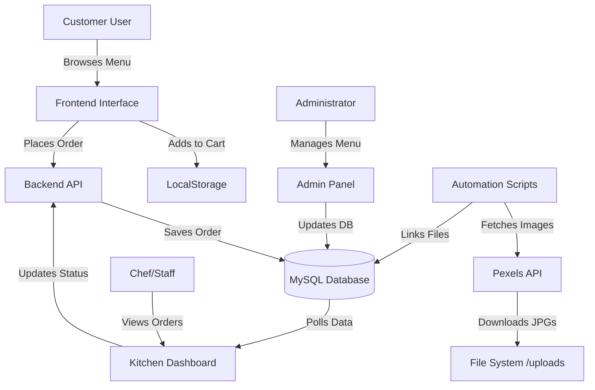
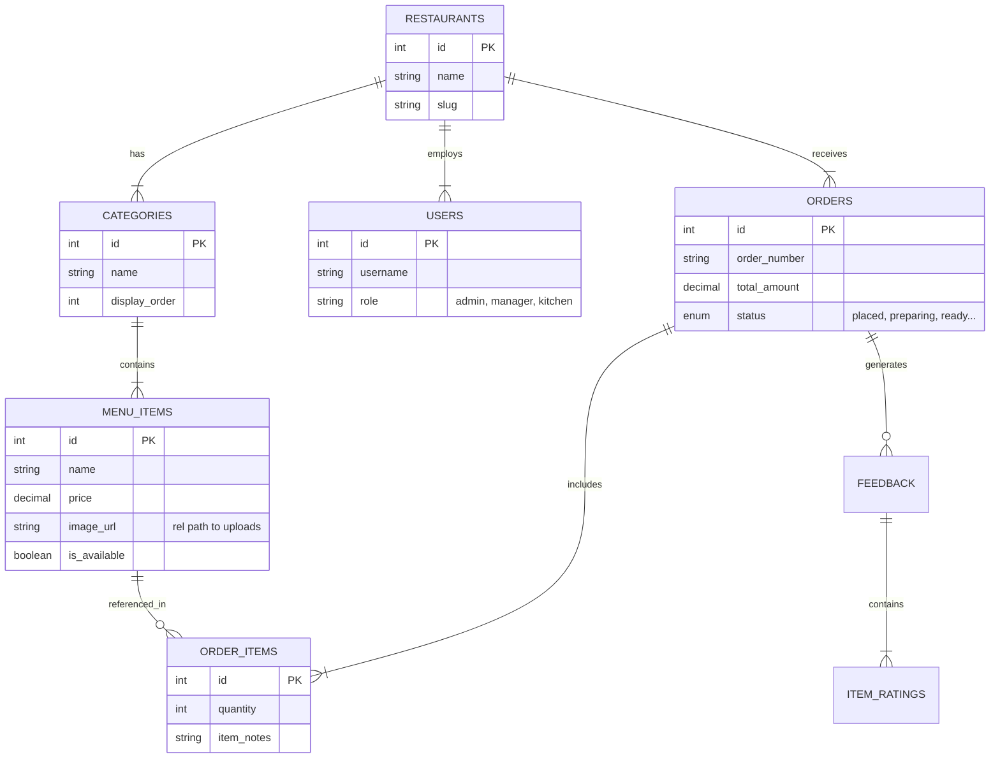

# Obito Ani Foodzz - Comprehensive Project Documentation

**Version**: 2.0
**Last Updated**: January 2026
**Tech Stack**: PHP 8, MySQL, JS (Vanilla + ES6), CSS3 (Custom Grid/Flex), Pexels API

---

## 1. Project Overview

**Obito Ani Foodzz** is a modern, full-stack restaurant management system designed for high-efficiency food ordering and kitchen operations. It bridges the gap between digital customer ordering and kitchen workflow, wrapped in a sleek, monochrome aesthetic.

### Key Differentiators
-   **Automated Asset Management**: The system self-populates with high-quality food images using the Pexels API, ensuring a professional look with zero manual effort.
-   **Unified Monolith**: A single codebase manages Customer, Admin, and Kitchen interfaces.
-   **Resilient Database**: Self-healing setup scripts ensuring data integrity and asset linkage.

---

## 2. Core Modules & Features

### A. Customer User Interface (Frontend)
-   **Smart Menu Browsing**:
    -   Dynamic category filtering (Pill-shaped toggles).
    -   Real-time search (by name or description).
    -   Modal views for item details (Ingredients, Price, Customization).
-   **Shopping Cart System**:
    -   Persistent cart using LocalStorage (survives refreshes).
    -   Live tax calculation (CGST/SGST).
    -   Special instructions per item.
-   **Feedback & Reviews**:
    -   Verified purchase reviews.
    -   5-star rating system for individual items and overall service.

### B. Administrator Panel
-   **Dashboard Hub**:
    -   Real-time counters for Pending Orders, Revenue, and Active Items.
    -   Interactive Status Board.
-   **Menu Management (CRUD)**:
    -   Add/Edit/Delete Categories and Items.
    -   Toggle item availability (Stock management).
-   **Order Operations**:
    -   View full order history.
    -   Update order status (Placed -> Preparing -> Ready -> Served).
    -   Print receipts.
-   **Feedback Management**:
    -   View incoming customer reviews.
    -   Reply functionality (Admin responses appear on frontend).
-   **Automation**:
    -   One-click database reset and image re-downloading.

### C. Kitchen Display System (KDS)
-   **Live Order Board**:
    -   Auto-refreshing view of active orders.
    -   Color-coded cards based on priority/time.
-   **Status Workflow**:
    -   Chefs can mark items/orders as "Cooking" or "Ready" with a single click.

---

## 3. System Architecture

### Application Flow

---

## 4. Database Schema (ER Diagram)

The system uses a relational MySQL database designed for scalability.

### Entity Relationship Diagram (Mermaid)

### Table List

1.  **`restaurants`**: Multi-tenant support root.
2.  **`users`**: RBAC system (Super Admin, Admin, Manager, Chef, Waiter).
3.  **`categories`**: Menu sections (Breakfast, Lunch, etc.).
4.  **`menu_items`**: The core product catalog.
5.  **`orders`**: Header table for transactions.
6.  **`order_items`**: Line items for each transaction.
7.  **`feedback`**: Customer reviews and ratings.
8.  **`item_ratings`**: Granular ratings for specific dishes.
9.  **`notifications`**: System alerts (New Order, Stock Low).

---

## 5. Page List & Maps

### 🟢 Public Frontend (`/frontend/`)
| File | Purpose |
| :--- | :--- |
| `index.php` | **Home/Menu**: Main landing page with grid layout. |
| `cart.php` | **Checkout**: Cart summary and order placement. |
| `reviews.php` | **Social**: Customer testimonials wall. |
| `order-confirmation.php` | **Success**: Post-order summary and "Track Order" link. |

### 🔴 Admin Panel (`/frontend/admin/`)
| File | Purpose |
| :--- | :--- |
| `login.php` | Secure entry point. |
| `dashboard.php` | **HQ**: Statistics and live status board. |
| `menu-management.php` | CRUD interface for food items. |
| `category-management.php` | Ordering and naming of menu sections. |
| `order-history.php` | Archive of past sales. |
| `feedback-dashboard.php` | Moderation tool for reviews. |
| `reports.php` | (Hidden) Sales reporting tool. |
| `analytics.php` | (Hidden) Advanced charts. |

### 🟠 Kitchen Panel (`/frontend/kitchen/`)
| File | Purpose |
| :--- | :--- |
| `login.php` | Kitchen staff entry. |
| `dashboard.php` | **KDS**: High-contrast, big-button interface for chefs. |

---

## 6. Key Workflows

### 1. The Ordering Flow
1.  **Customer** arrives at `index.php`.
2.  Browses items (images fetched via Pexels).
3.  Clicks "Quick Add" or opens Modal for customization.
4.  Navigates to `cart.php`.
5.  Enters Table Number and clicks "Place Order".
6.  **Backend** creates `orders` record and calculates tax.
7.  Customer redirected to `order-confirmation.php`.

### 2. The Kitchen Flow
1.  **Chef** logs into KDS (`kitchen/dashboard.php`).
2.  Screen auto-refreshes every 30s (or via WebSocket if configured).
3.  New order appears as "Pending".
4.  Chef clicks **"Start Cooking"** -> Status updates to `preparing`.
5.  Chef finishes -> Clicks **"Ready"** -> Status updates to `ready`.
6.  Waiter gets notified (visual indicator) to serve table.

### 3. The Automation Flow (Setup)
1.  Developer runs `php backend/setup_db.php`.
2.  Script wipes and recreates database from `complete-setup.sql`.
3.  Script scans `menu_items` table for image filenames.
4.  Checks `uploads/food/` directory.
5.  **If missing**: Calls Pexels API with "Food Name" query -> Downloads image -> Saves unique file.
6.  **If exists**: Skips download to save bandwidth.
7.  Verifies integrity: "120 linked, 0 missing".

---

## 7. Developer Notes (Points to Remember)

*   **Image Pathing**: Frontend files are one level deep (`frontend/`). Image paths in DB are relative to root (`uploads/`). The frontend JS automatically handles this by prepending `../` where necessary.
*   **Unique Images**: The downloader enforces distinct images for every item by checking used Pexels Photo IDs globaly, ensuring "Idli" and "Mini Idli" don't share the same thumbnail.
*   **API Security**: The Pexels API Key is stored in the PHP script. In production, move this to `.env`.
*   **Database**: Uses `utf8mb4_unicode_ci` for full emoji/language support (important for reviews).

--- 
*End of Documentation*
